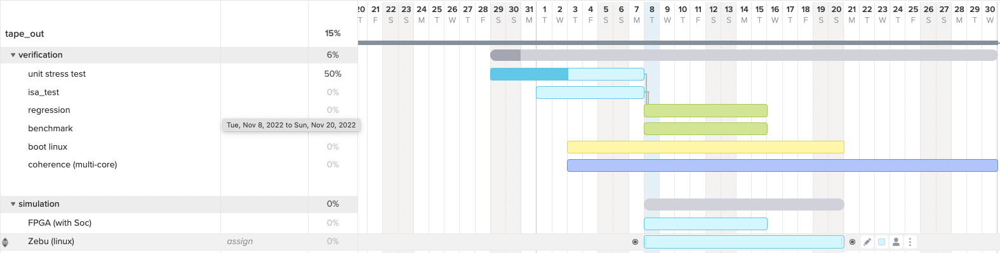
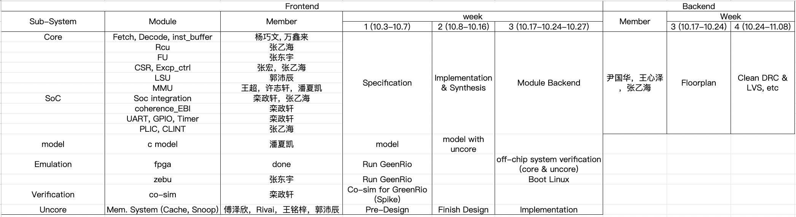

# GREENRIO2.0 (HEHECORE2.0)

## Overview

This is out-of-order RISC-V core written in synthesizable Verilog that supports the RV64ICMA unprivileged ISA and parts of the privileged ISA, support S, M and U mode.

## Design Feature List

- It supports RISC-V ICMA extension
- It supports U S M mode
- It's a double issue architecture
- It supports scalar register renaming
- It has a ROB to do in-order committment
- When an exception or an interrupt happens, the ROB will be responsible of when to trigger flush
- It supports dynamic branch prediction(gshare)
- It support out-of-order execution
- nonblocking cache
- It implements mmu with 3 level page table in sv39 mode
- cache coherence

## gantt chart

## work division

## overall review

### performance review
- ipc: 0.25 (for thousands of torture and isa test)
  - 0.3 for more branch instruction in test program
- bottleneck: 
  - icache (icache miss rate to do)
    - icache line only has 32 bits per line
    - icache compulsory miss need 5 cycle
      - fetch request need 1 cycle
      - SRAM hit or miss judgement need 2 cycle (skywater 130 sram feature)
      - memory model need 2 cycle (golden memory)
    - solution:
      - l1 cache has 8*16 bits per cache line
      - prefetch(to do)
  - single issue
    - not the bottleneck of 1.0

### coding standard(naming)
- variable
  - use lowercase letters for variables
  - for i/o variables, the name should end with "_i" and "_o" for input and output
- parameter
  - use capital letters for parameter
- hand shake
  - example: fetch and icache hand shake，fetch request signal:fetch_icache_req_valid_o，icache for fetch request ready signal: fetch_icache_req_ready_i, icache get the data signal: icache_fetch_resp_valid_i，fetch is ready to accept data from cache signal： icache_fetch_resp_ready_o

## Block Diagram

## Pipeline Stages(to do)

**1. Fetch**

Instructions are *fetched* from Icache and pushed into a FIFO queue, known as the instruction buffer(fetch buffer) . Looking up the branch target buffer also occurs in this stage, redirecting the fetched instructions as necessary

  **F0 stage:**

    PC_gen will generate the correct PC, the pirority is :*Backend-end redirct target -> predicted PC -> PC+4*.

    Meanwhile, Let PC do hashing with BHR, and get the hash index for Gshare.

  **F1 stage:**

    Sent the PC to Icache for instruction request

    Do*pc+4*

    Use PC to index a BTB entry and get*pc_pred.*

    Use the hash value to index Gshare and get*taken or not-taken*.

  **F2 stage:**

    The response from Icache is put into a FIFO instruction buffer

    Sent*pc+4* to the PC_gen

    In Redirct logic, if Gshare predicts taken, it will sent pc_pred to PC_gen. Otherwise, pc_gen makes no sense.

**2. Decode**

  **F3 stage**

    In this stage, it pulls instructions out of the instruction buffer and generates the appropriate micro-op($\mu$op) to place into the pipeline

- decode <=2 instruction per cycle

**3. Issue**

  **F4 stage**

    The ISA, or “logical”, register specifiers (e.g. x0-x31) are then*renamed* into “physical” register specifiers

    Every instruction will do dependency check with its previous instruction to decide whether instructions will be double issued.

    $\mu$op sitting in the head of ROB wait until all of their source registers are ready and they can read their operand then be issued.  This is the beginning of the out–of–order piece of the pipeline.

- Double issue conditions:
  1. There is no dependency between the two instructions
  2. Function units are both ready
  3. Only arithemetic and load/store instructions can be double issued. (excluding conditional,csr, wfi etc.)

**4. Execute**
  **F5 stage**
  Instructions enter the *Execute* stage where the functional units reside. Issued ALU operations perform their calculation and get results.

  For load&store instruction, first the address are calculated and put into the FIFO load/store queue. The instrution at the head of the queue sends request to Dcache if Dcache is ready.

**5. Wrieback**
  **F6 stage**
  results are written back to physical registers when completing instruction and update ROB status

- About branch prediction
  If it's a branch instruction, the result will update Gshare and GHR. If it's mispredicted, the instruction buffer will be flushed, and instructions will be fetched from the other path.

**6. Instruction commit**
The Reorder Buffer (ROB), tracks the status of each instruction in the pipeline. When the head of the ROB is not-busy, the ROB commits the instruction.

- instructions will be commited in order in ROB according to program order, at most 2 instructions can be commited at the same time

# Block Description

## Fetch

[fetch.md](./units/fetch_spec.md)

### Backend result:
- frequency: 80Mhz
- cell: 5311
- report_worst_slack -max (Setup)
  - worst slack 3.61

- report_worst_slack -min (Hold)
  - worst slack 0.21

## Decode

[decode.md](./units/decode.md)

### Backend result
- frequency: 80 MHz
- cells: 9023
- report_worst_slack -max (Setup): worst slack 3.23
- report_worst_slack -min (Hold): worst slack 0.19

## RCU

[rcu.md](./units/rcu_spec.md)

### Backend result:
- frequency: 80Mhz
- cell: 86883
- report_worst_slack -max (Setup)
  - worst slack -4.50

- report_worst_slack -min (Hold)
  - worst slack 0.19

## Fu

[fu.md](./units/fu.md)

## Lsu

[lsu.md](./units/lsu_spec.md)

### Backend result:
- frequency: 60Mhz
- cell: 6172
- report_worst_slack -max (Setup)
  - worst slack 1.11

- report_worst_slack -min (Hold)
  - worst slack 0.20

## MMU & TLB

[mmu.md](./units/MMU.md)

- frequency: 80Mhz
- cell: 27887
- report_worst_slack -max (Setup)
  - worst slack 3.089

- report_worst_slack -min (Hold)
  - worst slack 0.428

## Exception_ctrl

[excetion_ctrl.md](./units/excep_ctrl_spec.md)

## SOC

[soc.md](./units/soc.md)

## C model
- ipc: 0.8 ~ 1.2 (through 1003 torture) 
- use original model with our achitecture parameter