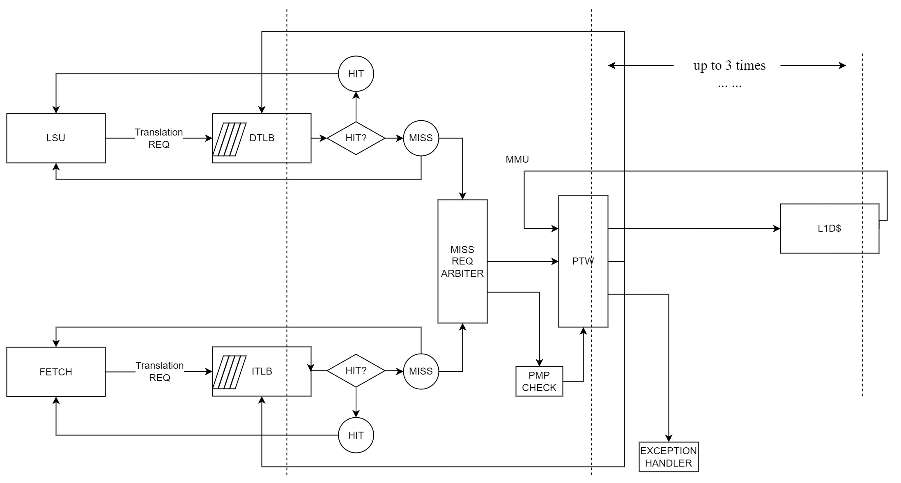

# Memory Management Unit

## 1. Instruction

GreenRio 2.0 provides support for Sv39 virtual memory system. Necessary units for translating, mapping and address caching are integrated in MMU module. GreenRio 2.0 is implemented with seperated TLB (Translation Lookaside Buffer) for data and instructions. This module contains DTLB, ITLB, Page-Table walker and an arbitrator scheduling translation requests from DTLB and ITLB to PTW.

MMU module handles translation requests from both LSU and IFU, where either load/store requests or load-only requests are generated. Translation will be looked up within TLB with VPN as index. DTLB and ITLB can be queried simutainously. GreenRio 2.0 provides each TLB with capacity of 32 PTEs, which enables faster looking-aside. Once TLB returns a cached PTE (Page Table Entry) with coresponding PPN, MMU will return a hit signal and finish serving the request. Otherwise TLB may generate walking request to PTW to refill the missing PTE. PTW walks the page-tables through ports connecting L1 data cache. In handling a TLB miss, MMU will continously set the miss signal until either all page table walking is down or exception is raised.

PTW provides a throughput of 1 miss request regardless of whether the request is from DTLB or ITLB. MMU sets a scheme that page-table walk requests from DTLB are served in prior to those from ITLB, considering that memory accesses for runtime data are always driven by those for instructions. PTW maintains a finite state machine of 3 states, idle, check-permission and in-flight. On a walking request arrives, PTW transfers from idle to check-permission, looking up all valid PMP entries with proposed PPN. This PPN is calculated with base address in SATP CSR and offset from the in-coming VPN. If PMP check is passed, PTW transfers into in-flight state, issuing memory load request to L1 data cache.

On recieving response PTE from L1 data cache, PTW checks the 10-lowest bits to determine if it is a leaf PTE, which ends the walking procedure. Non-leaf PTE provides base address for next walk, as the decrement of the level of active page table. In Sv39, one walk request will finish in up to 3 levels of page table.

In order to improve pipeline performance, GreenRio 2.0 provides MSHR structure in MMU to handle missed DTLB requests, along with easily-extensible width in PTW. Current architecture makes use of an MSHR with 4 entries and a PTW with 1 concurrent processing width.

## MMU

### Diagram

### Parameters

| Name             | Default Value | Description                              |
| :--------------- | :------------ | ---------------------------------------- |
| PTW_ID_WIDTH     | 1             | Throughput                               |
| TRANS_ID_WIDTH   | 3             | TLB MSHR capacity                        |
| PADDR_WIDTH      | 40            | physical address width                   |
| EXCP_CAUSE_WIDTH | 64            | Exception cause width                    |
| VPN_WIDTH        | 27            | vpn width                                |
| PMP_ENTRY_COUNT  | 8             | pmp entry number                         |

### Ports

| Signal                        | I/O  | Width                        | Description                           |
| ----------------------------- | ---- | ---------------------------- | ------------------------------------- |
| priv_lvl_i                    | in   | [1:0] logic                  | priv lvl                              |
| pmp_cfg_set_vld_i             | in   | logic                        | PMP Configuration Port                |
| pmp_cfg_set_addr_i            | in   | [PMPCFG_ID_WIDTH-1:0] logic  |                                       |
| pmp_cfg_set_payload_i         | in   | [63:0] logic                 |                                       |
| pmp_cfg_origin_payload_o      | out  | [63:0] logic                 |                                       |
| pmp_addr_set_vld_i            | in   | logic                        |                                       |
| pmp_addr_set_addr_i           | in   | [PMPADDR_ID_WIDTH-1:0] logic |                                       |
| pmp_addr_set_payload_i        | in   | [63:0] logic                 |                                       |
| pmp_addr_origin_payload_o     | out  | [63:0] logic                 |                                       |
| satp_mode_i                   | in   | [3:0] logic                  | stap                                  |
| satp_ppn_i                    | in   | [PPN_WIDTH-1:0] logic        |                                       |
| dtlb_miss_req_vld_i           | in   | logic                        | DTLB Miss -> To Next Level Request    |
| dtlb_miss_req_trans_id_i      | in   | [TRANS_ID_WIDTH-1:0] logic   |                                       |
| dtlb_miss_req_asid_i          | in   | [ASID_WIDTH-1:0] logic       |                                       |
| dtlb_miss_req_vpn_i           | in   | [VPN_WIDTH-1:0] logic        |                                       |
| dtlb_miss_req_access_type_i   | in   | [1:0] logic                  |                                       |
| dtlb_miss_req_rdy_o           | out  | logic                        |                                       |
| dtlb_miss_resp_vld_o          | out  | logic                        | DTLB Miss -> From Next Level Response |
| dtlb_miss_resp_trans_id_o     | out  | [TRANS_ID_WIDTH-1:0] logic   | TLB MSHR index   |
| dtlb_miss_resp_asid_o         | out  | [ASID_WIDTH-1:0] logic       | TLB entry ASID                        |
| dtlb_miss_resp_pte_o          | out  | [PTE_WIDTH-1:0] logic        |                                       |
| dtlb_miss_resp_page_lvl_o     | out  | [PAGE_LVL_WIDTH-1:0] logic   |                                       |
| dtlb_miss_resp_vpn_o          | out  | [VPN_WIDTH-1:0] logic        |                                       |
| dtlb_miss_resp_access_type_o  | out  | [1:0] logic                  |                                       |
| dtlb_miss_resp_access_fault_o | out  | logic                        |                                       |
| dtlb_miss_resp_page_fault_o   | out  | logic                        |                                       |
| itlb_miss_req_vld_i           | in   | logic                        | ITLB Miss -> To Next Level Request    |
| itlb_miss_req_trans_id_i      | in   | [TRANS_ID_WIDTH-1:0] logic   | TLB MSHR index  |
| itlb_miss_req_asid_i          | in   | [ASID_WIDTH-1:0] logic       | TLB entry ASID                        |
| itlb_miss_req_vpn_i           | in   | [VPN_WIDTH-1:0] logic        |                                       |
| itlb_miss_req_rdy_o           | out  | logic                        |                                       |
| itlb_miss_resp_vld_o          | out  | logic                        | ITLB Miss -> From Next Level Response |
| itlb_miss_resp_trans_id_o     | out  | [TRANS_ID_WIDTH-1:0] logic   |                                       |
| itlb_miss_resp_asid_o         | out  | [ASID_WIDTH-1:0] logic       |                                       |
| itlb_miss_resp_pte_o          | out  | [PTE_WIDTH-1:0] logic        |                                       |
| itlb_miss_resp_page_lvl_o     | out  | [PAGE_LVL_WIDTH-1:0] logic   |                                       |
| itlb_miss_resp_vpn_o          | out  | [VPN_WIDTH-1:0] logic        |                                       |
| itlb_miss_resp_access_type_o  | out  | [1:0] logic                  |                                       |
| itlb_miss_resp_access_fault_o | out  | logic                        |                                       |
| itlb_miss_resp_page_fault_o   | out  | logic                        |                                       |
| ptw_walk_req_vld_o            | out  | logic                        | ptw walk request port                 |
| ptw_walk_req_id_o             | out  | [PTW_ID_WIDTH-1:0] logic     |                                       |
| ptw_walk_req_addr_o           | out  | [PADDR_WIDTH-1:0] logic      |                                       |
| ptw_walk_req_rdy_i            | in   | logic                        |                                       |
| ptw_walk_resp_vld_i           | in   | logic                        | ptw walk response port                |
<!-- | ptw_walk_resp_id_i            | in   | [PTW_ID_WIDTH-1:0] logic     |                                       | -->
| ptw_walk_resp_pte_i           | in   | [PTE_WIDTH-1:0] logic        |                                       |
| ptw_walk_resp_rdy_o           | out  | logic                        |                                       |
| tlb_flush_vld_i               | in   | logic                        | tlb shoot down                        |
| tlb_flush_use_asid_i          | in   | logic                        |                                       |
| tlb_flush_use_vpn_i           | in   | logic                        |                                       |
| tlb_flush_vpn_i               | in   | [VPN_WIDTH-1:0] logic        |                                       |
| tlb_flush_asid_i              | in   | [ASID_WIDTH-1:0] logic       |                                       |
| tlb_flush_grant_o             | out  | logic                        |                                       |
| clk                           | in   | logic                        |                                       |
| rstn                          | in   | logic                        |                                       |

## PTW

### Parameters

| Name             | Default Value | Description                              |
| :--------------- | :------------ | ---------------------------------------- |
| TRANS_ID_WIDTH   | 3             | TLB MSHR capacity                        |
| PADDR_WIDTH      | 40            | physical address width                   |
| EXCP_CAUSE_WIDTH | 64            | Exception cause width                    |
| VPN_WIDTH        | 27            | VPN width                                |
| ASID_WIDTH       | 16            | ASID width                               |
| PMP_ENTRY_COUNT  | 8             | PMP entry number                         |

### Ports

| Name                          | Direction | Type                         | Description             |
| :---------------------------- | :-------- | :--------------------------- | ----------------------- |
| priv_lvl_i                    | in        | [1:0] logic                  | priv lvl                |
| pmp_cfg_set_vld_i             | in        | logic                        | PMP Configuration Port  |
| pmp_cfg_set_addr_i            | in        | [PMPCFG_ID_WIDTH-1:0] logic  |                         |
| pmp_cfg_set_payload_i         | in        | [63:0] logic                 |                         |
| pmp_cfg_origin_payload_o      | out       | [63:0] logic                 |                         |
| pmp_addr_set_vld_i            | in        | logic                        |                         |
| pmp_addr_set_addr_i           | in        | [PMPADDR_ID_WIDTH-1:0] logic |                         |
| pmp_addr_set_payload_i        | in        | [63:0] logic                 |                         |
| pmp_addr_origin_payload_o     | out       | [63:0] logic                 |                         |
| satp_mode_i                   | in        | [3:0] logic                  | stap                    |
| satp_ppn_i                    | in        | [PPN_WIDTH-1:0] logic        |                         |
| translate_req_vld_i           | in        | logic                        | translate request port  |
| translate_req_trans_id_i      | in        | [TRANS_ID_WIDTH-1:0] logic   |                         |
| translate_req_asid_i          | in        | [ASID_WIDTH-1:0] logic       |                         |
| translate_req_vpn_i           | in        | [VPN_WIDTH-1:0] logic        |                         |
| translate_req_access_type_i   | in        | [1:0] logic                  |                         |
| translate_req_rdy_o           | out       | logic                        |                         |
| translate_resp_vld_o          | out       | logic                        | translate response port |
| translate_resp_asid_o         | out       | [ASID_WIDTH-1:0] logic       |                         |
| translate_resp_pte_o          | out       | [PTE_WIDTH-1:0] logic        |                         |
| translate_resp_page_lvl_o     | out       | [PAGE_LVL_WIDTH-1:0] logic   |                         |
| translate_resp_trans_id_o     | out       | [TRANS_ID_WIDTH-1:0] logic   |                         |
| translate_resp_vpn_o          | out       | [VPN_WIDTH-1:0] logic        |                         |
| translate_resp_access_type_o  | out       | [1:0] logic                  |                         |
| translate_resp_access_fault_o | out       | logic                        |                         |
| translate_resp_page_fault_o   | out       | logic                        |                         |
| ptw_walk_req_vld_o            | out       | logic                        | ptw walk request port   |
| ptw_walk_req_addr_o           | out       | [PADDR_WIDTH-1:0] logic      |                         |
| ptw_walk_req_rdy_i            | in        | logic                        |                         |
| ptw_walk_resp_vld_i           | in        | logic                        | ptw walk response port  |
| ptw_walk_resp_pte_i           | in        | [PTE_WIDTH-1:0] logic        |                         |
| ptw_walk_resp_rdy_o           | out       | logic                        |                         |
| clk                           | in        | logic                        |                         |
| rstn                          | in        | logic                        |                         |