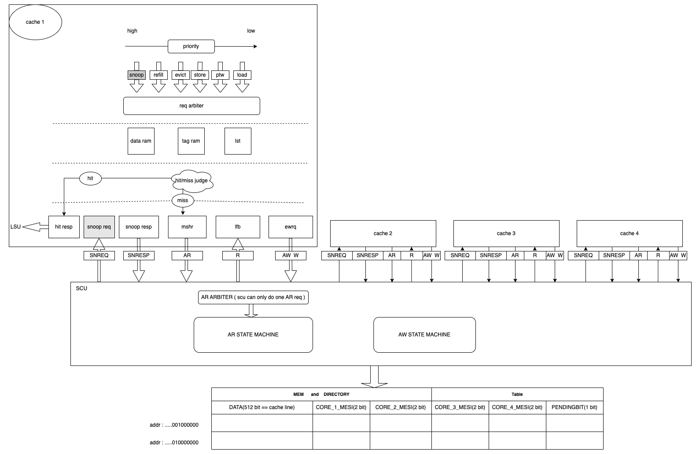

# l1d cache amo coherence

## 1 cache

## 2 amo

### 2.1 amo pipeline

  * s0
    * flush store buffer
  * s1 
    * the store buffer is cleared
    * send the amo req by store req port directly to the cache bank
    * cache bank read tag ram, read data ram, read lst (like a load req)
  * s2
    * compare tag, check lst state
      * if hit(state E/M), goto **alu**
      * if miss, allocate mshr, ReadUnique, goto **refill**
  * refill
    * in mlfb refill fsm, goto **alu**
  * alu
    * do alu calculation, goto **write_resp**
  * write_resp
    * finish refill/store by new data into data ram
    * update tag ram, lst if needed
    * resp to lsu with old data

### 2.2 lr/sc pipeline

Let lr get M permission, set the reservation table.

To clear the reservation table if:
  * a snoop from SCU hit the same cache line, no matter it is a snpS or snpM.
  * the reserved cache line is evicted
  * a store or sc to the reserved cache line
  * a younger lr would overwrite the older lr

To fail a sc if:
  * check for reservation table fail
  * check for M permission fail
  * tag miss

As snpS can clear the reservation table and fail the sc, this design has potential livelock risk if multithread frequently load or lr the lock. This can help to simplize hardware design. The livelock rick can be solved by lock lr resered cache line serval cycles after a given number of consecutive sc failures.

#### 2.2.1 lr

  * s0
    * flush store buffer
  * s1
    * the store buffer is cleared
    * send the lr req by store req port directly to the cache bank
    * cache bank read tag ram, read data ram, read lst (like a load req)
  * s2
    * compare tag, check lst state
      * if hit(state E/M), goto **s3**
      * if miss, allocate mshr, ReadUnique, goto **refill**
  * s3
    * set reservation table in lst
    * resp to lsu with data
  * refill
    * in mlfb refill fsm, set reservation table in lst
    * finish refill/store by new data into data ram
    * update tag ram, lst if needed
    * resp to lsu with data

#### 2.2.2 sc

  * s0
    * flush store buffer
  * s1
    * the store buffer is cleared
    * send the sc req by store req port directly to the cache bank
    * cache bank read tag ram, read lst (like a store req)
    * read reservation table
  * s2
    * compare tag, check lst state
      * if hit(state E/M, reservation table valid), goto **sc_succ**
      * else if miss goto **sc_fail**
  * sc_succ
    * clear reservation table in lst
    * resp 0 to lsu
    * write new data into data ram
  * sc_fail
    * clear reservation table in lst
    * resp 1 to lsu

## 3 coherence

### 3.1 interface
| channel             | signal              |    width    |   description            |
| ------------------- | ------------------- | ----------  | ---------------------    |
| ADDRESSREAD(AR)     | l2_req_if_arvalid   |      1      |                          |
|                     | l2_req_if_arready   |      1      |                          |
|                     | l2_req_if_ar_araddr | PADDR_WIDTH |                          |
|                     | l2_req_if_ar_arsnoop|      4      | snoop msg                |
| READ(R)             | l2_resp_if_rvalid   |      1      |                          |
|                     | l2_resp_if_rready   |      1      |                          |
|                     | l2_resp_if_r_dat    |      64     |                          |
|                     | l2_resp_if_r_mesi   |      2      |                          |
| ADDRESSWRITE(AW)    | l2_req_if_awvalid   |      1      |                          | 
|                     | l2_req_if_awready   |      1      |                          |         
|                     | l2_req_if_aw_awaddr | PADDR_WIDTH |                          |
|                     | l2_req_if_aw_mesi   |      2      | mesi type                |
| WRITE(W)            | l2_req_if_wvalid    |      1      |                          |
|                     | l2_req_if_wready    |      1      |                          |
|                     | l2_req_if_w_data    |      64     |                          |
| SNOOPREQ(SNREQ)     | l2_req_if_snvalid   |      1      |                          |
|                     | l2_req_if_snready   |      1      |                          |
|                     | l2_req_if_sn_addr   | PADDR_WIDTH |                          |
|                     | l2_req_if_sn_snoop  |      4      | snoop msg                |
| SNOOPRESP(SNRESP)   | l2_resp_if_snvalid  |      1      |                          |
|                     | l2_resp_if_snready  |      1      |                          |
|                     | l2_resp_if_has_data |      1      | whether resp has data    |
|                     | l2_resp_if_resp_data|      64     |                          |
|                     | l2_resp_if_sn_ack   |      1      | resp ack but not data    |

### 3.2 snoop msg
| snoop_type(4 bit)   | which channel can this type be appeared | discription
| ------------------- | --------------------------------------- | ----------- |
|  READ_DIRECTORY     | AR                                      | the req is ld, but it miss, it should send READ_DIRECTORY to the scu
|  WRITE_DIRECTORY    | AR                                      | the req is st, but it miss, it should send WRITE_DIRECTORY to the scu
|  READ_SNOOP         | SNREQ                                   | the req is ld, after sending the READ_DIRECTORY to scu, if the corresponding directory is M/E , send READ_SNOOP to the corresponding core
|  WRITE_SNOOP        | SNREQ                                   | the req is st, after sending the WRITE_DIRECTORY to scu, if the corresponding directory is M/E , send WRITE_SNOOP to the corresponding core           
|  INVALID            | SNREQ                                   | make the corresponding cache line INVALID
|  EXCLUSIVE          | SNREQ                                   | make the corresponding cache line EXCLUSIVE

### 3.3 all event / state machine / ut spec (add them after pass the coherence by using ut)
#### 3.3.1 

#### 3.3.2

