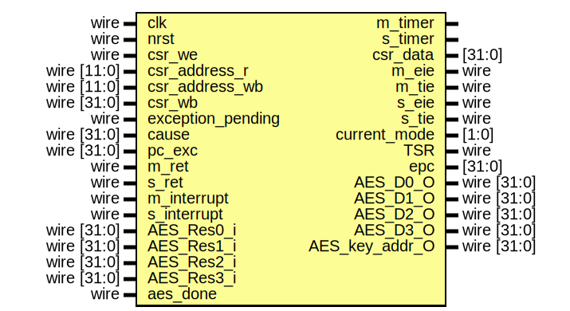

# Entity: csr_regfile 

- **File**: csr_regfile.v
## Diagram

## Ports

| Port name           | Direction | Type        | Description |
| ------------------- | --------- | ----------- | ----------- |
| clk                 | input     | wire        |             |
| rst                 | input     | wire        |             |
| csr_we_i            | input     | wire        |             |
| csr_address_r_i     | input     | wire [11:0] |             |
| csr_address_w_i     | input     | wire [11:0] |             |
| csr_wb_i            | input     | wire [XLEN:0] |             |
| exception_pending_i | input     | wire        |             |
| cause_i             | input     | wire [XLEN:0] |             |
| pc_exc_i            | input     | wire [XLEN:0] |             |
| m_ret_i             | input     | wire        |             |
| s_ret_i             | input     | wire        |             |
| m_interrupt_i       | input     | wire        |             |
| s_interrupt_i       | input     | wire        |             |
| m_timer_o           | output    |             |             |
| s_timer_o           | output    |             |             |
| csr_data_o          | output    | [XLEN:0]      |             |
| m_eie_o             | output    | wire        |             |
| m_tie_o             | output    | wire        |             |
| s_eie_o             | output    | wire        |             |
| s_tie_o             | output    | wire        |             |
| current_mode_o      | output    | [1:0]       |             |
| TSR_o               | output    | wire        |             |
| epc_o               | output    | [XLEN:0]      |             |
| readable_o          | output    | wire        |             |
| writeable_o         | output    | wire        |             |
## Signals

| Name             | Type        | Description |
| ---------------- | ----------- | ----------- |
| next_mode        | reg [1:0]   |             |
| status_sie       | reg         |             |
| status_mie       | reg         |             |
| status_spie      | reg         |             |
| status_mpie      | reg         |             |
| status_spp       | reg         |             |
| status_mpp       | reg [1:0]   |             |
| status_TSR       | reg         |             |
| status_sum       | reg         |             |
| meie             | reg         |             |
| seie             | reg         |             |
| mtie             | reg         |             |
| stie             | reg         |             |
| mcause_interrupt | reg         |             |
| mcause_code      | reg [30:0]  |             |
| scause_interrupt | reg         |             |
| scause_code      | reg [30:0]  |             |
| mtvec            | reg [XLEN:2]  |             |
| stvec            | reg [XLEN:2]  |             |
| mscratch         | reg [XLEN:0]  |             |
| sscratch         | reg [XLEN:0]  |             |
| mcause           | wire [XLEN:0] |             |
| scause           | wire [XLEN:0] |             |
| mepc             | reg [XLEN:0]  |             |
| sepc             | reg [XLEN:0]  |             |
| mtval            | reg [XLEN:0]  |             |
| medeleg          | reg [15:0]  |             |
| mideleg          | reg [11:0]  |             |
| sedeleg          | reg [15:0]  |             |
| sideleg          | reg [11:0]  |             |
| stval            | reg [XLEN:0]  |             |
| mstatus          | wire [XLEN:0] |             |
| mip              | wire [XLEN:0] |             |
| mie              | wire [XLEN:0] |             |
| sstatus          | wire [XLEN:0] |             |
| sip              | wire [XLEN:0] |             |
| sie              | wire [XLEN:0] |             |
| medeleg_w        | wire [XLEN:0] |             |
| mideleg_w        | wire [XLEN:0] |             |
| sedeleg_w        | wire [XLEN:0] |             |
| sideleg_w        | wire [XLEN:0] |             |
| tvec_out         | reg [XLEN:0]  |             |
| stimecmp         | reg [63:0]  |             |
| mtimecmp         | reg [63:0]  |             |
| timer            | reg [63:0]  |             |

## Machine-Level CSRs

### misa

固定值 XLEN = 64 with I C A M S U

### mvendorid marchid mimpid mconfigptr

用于记录 CPU 信息或 M 模式配置，均未实现

### mhartid

单核固定只读 0

### mstatus

* mstatus[1], mstatus[3]: SIE, MIE: 决定在当前特权级时中断是否使能，对于更低特权级，默认不存在，对于更高特权级默认存在：如 S 下中断使能看 SIE 同特权级 U 中断使能默认为无 S 中断使能默认为有
* mstatus[17]: MPRV, ModifyPRiV, MPRV = 1 时，所有的 load store 操作都需要经过翻译和保护，反之则按普通情况处理即 S 和 U 模式翻译而 M 模式不翻译，MRET 和 SRET 之后此位置 0.
* mstatus[19]: MXR, 当 MXR = 1 时，从标记为 Readable 和 Executable 的内存中 load 都可以成功，但没有启用内存分页时此项无效
* mstatus[18]: SUM, 当 SUM = 1 时，S 下访问 U 的虚拟内存页时可以成功，反之会失败 (此处原文：When SUM=0, S-mode memory accesses to pages that are accessible by U-mode will fault.)
* mstatus[20]: TVM, Trap Virtual Memory, TVM = 1 时，S 下执行 SFENCE.VMA SINVAL.VMA 和访问 satp 寄存器会产生非法指令异常，在我们的实现中计划此位为 ro 0.
* mstatus[21]: TW, Timeout Wait, TW = 0 时可以在更低特权级中执行 WFI ，TW = 1 时低特权级执行 WFI 未在时限内完成将产生非法指令异常，主要用于 world switch 计划设置为 ro 0.
* mstatus[22]: TSR, Trap Supervisor Return, TSR = 1 时在 S 下执行 SRET 将产生非法指令异常，用于模拟 Hypervisor Extension.

### mtvec

mtvec[1:0] 两位用于设置指令存储模式，MODE = 0 时 trap 将 PC 置为 BASE = mtvec[XLEN-1:1]，MODE = 1 时 trap 将 PC 置为 BASE + 4 * cause

### mideleg medeleg mie mip

[15:0] 位用于各种 Interrupt 和 Exception 的委托、使能、进行状态标记，mxdeleg 寄存器可读写用于设置中断委托，对应中断位为 1 时，将委托给 S 处理

### mepc

异常发生的 PC 值

### mcause

异常代码，最高位指示是否是 Interrupt

### mtval

异常信息，当发生访存错误、页错误、未对齐存取，存储发生错误的虚拟内存地址或未对齐的部分，当发生非法指令异常，存储指令本身的编码，未实现

### mscratch

在 M 存储当前执行的上下文指针，当进入 M 的 trap handler 时与用户寄存器交换值

### menvcfg mseccfg

可选 M 环境配置、安全特性配置寄存器，未实现

### mcycle minstret mcounteren mhpmcounterx mcountinhibit

性能监视寄存器，未实现

## Supervisor-Level CSRs

### sstatus

类似于 mstatus 也存在 SIE 和 SUM 以及 MXR 为了保证一致性，在不同特权级操作这些位是相同的，即 S 设置 sstatus 中的 SIE 位 mstatus.SIE 也会改变

### stvec sip sie scratch sepc scause stval

类似于 M 对应的寄存器，在 Kernel 中均有引用，除 stval 已实现

### satp

存储 ASID 和根页表的 PPN 以及分页模式

### senvcfg

存储 Supervisor 配置，Kernel 未引用，未实现

### scounteren

S 和 U 共用 cycle time instret hpmcounterx 寄存器，scounteren 用于配置这些寄存器对于 U 是否可用，均未实现

## Processes
- validata_address: ( @(*) )
  - **Type:** always
- assign_csr_output: ( @(*) )
  - **Type:** always
  - **Description**
  assign value to csr_data as output according to csr_address_r
 
- update_inner_signals: ( @(posedge clk or negedge rst) )
  - **Type:** always
  - **Description**
  update inner signals of CSR Register file; if reset, current_mode_o = 3 (Machine Mode)
 
- assign_output_ports: ( @(*) )
  - **Type:** always
  - **Description**
  assign values to output ports
 
- update_timer: ( @(posedge clk or negedge rst) )
  - **Type:** always
- m_timer_reset_check: ( @(posedge clk or negedge rst) )
  - **Type:** always
- s_timer_reset_check: ( @(posedge clk or negedge rst) )
  - **Type:** always
- init_tvec: ( @(*) )
  - **Type:** always
- trap_return: ( @(*) )
  - **Type:** always
