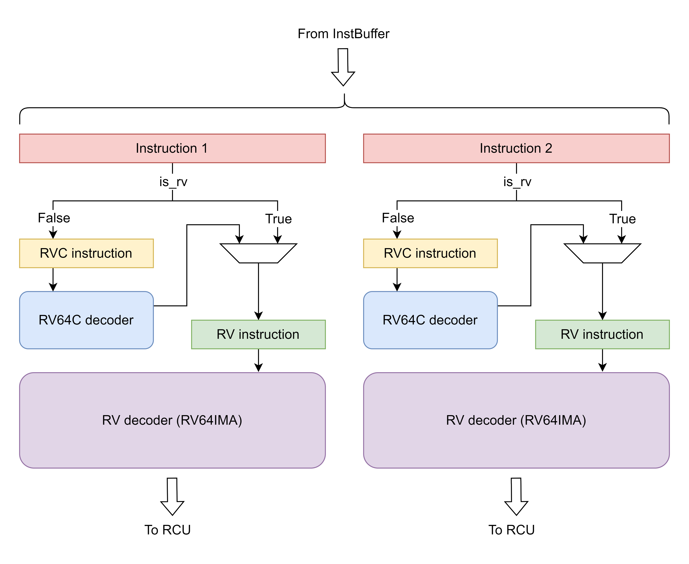

# Decode Spec

This decoder supports RV64IMAC instructions. It gets the instr from fetch unit and gives the result to ROB unit. For branch instr, it will output a stall flag, until everything is ready.

## Revision History

| Revision Number | Author     | Date       | Description |
| --------------- | ---------- | ---------- | ----------- |
| 0.1             | Guohua Yin | 2022.08.16 | init        |
| 0.2             | Guohua Yin | 2022.08.22 | update      |
| 1.0             | Xinlai Wan | 2022.10.06 | init        |

## Items

| Item Name | Description                                                 |
| --------- | ----------------------------------------------------------- |
| decode    | decode the instruction in-order from the instruction buffer |

## Interface
| signal                           | I/O |    width    |                 description                   | interaction  |
| :------------------------------: | :-: | :---------: | :-------------------------------------------: | :----------: |
| clk                              |  I  |      1      |                 clock signal                  |      -       |
| rst                              |  I  |      1      | reset signal, active high, asynchronous reset |      -       |

### With ROB
| signal                           | I/O |    width     |                 description                  | interaction  |
| :------------------------------: | :-: | :----------: | :------------------------------------------: | :----------: |
| uses_rs1_first_o                 |  O  |      1       |                   use rs1                    |     rob      |
| uses_rs1_second_o                |  O  |      1       |                   use rs1                    |     rob      |
| uses_rs2_first_o                 |  O  |      1       |                   use rs2                    |     rob      |
| uses_rs2_second_o                |  O  |      1       |                   use rs2                    |     rob      |
| uses_rd_first_o                  |  O  |      1       |                    use rd                    |     rob      |
| uses_rd_second_o                 |  O  |      1       |                    use rd                    |     rob      |
| uses_csr_first_o                 |  O  |      1       |                   use csr                    |     rob      |
| uses_csr_second_o                |  O  |      1       |                   use csr                    |     rob      |
| pc_first_o                       |  O  |   PC_WIDTH   |                  current pc                  |     rob      |
| pc_second_o                      |  O  |   PC_WIDTH   |                  current pc                  |     rob      |
| next_pc_first_o                  |  O  |   PC_WIDTH   |                 the next pc                  |     rob      |
| next_pc_second_o                 |  O  |   PC_WIDTH   |                 the next pc                  |     rob      |
| predicted_pc_first_o             |  O  |   PC_WIDTH   |               the predicted pc               |     rob      |
| predicted_pc_second_o            |  O  |   PC_WIDTH   |               the predicted pc               |     rob      |
| rs1_address_first_o              |  O  |      5       |             decode field to rob              |     rob      |
| rs1_address_second_o             |  O  |      5       |             decode field to rob              |     rob      |
| rs2_address_first_o              |  O  |      5       |             decode field to rob              |     rob      |
| rs2_address_second_o             |  O  |      5       |             decode field to rob              |     rob      |
| rd_address_first_o               |  O  |      5       |             decode field to rob              |     rob      |
| rd_address_second_o              |  O  |      5       |             decode field to rob              |     rob      |
| csr_address_first_o              |  O  |     12       |             decode field to rob              |     rob      |
| csr_address_second_o             |  O  |     12       |             decode field to rob              |     rob      |
| mret_first_o                     |  O  |      1       |            mret instruction flag             |     rob      |
| mret_second_o                    |  O  |      1       |            mret instruction flag             |     rob      |
| sret_first_o                     |  O  |      1       |            sret instruction flag             |     rob      |
| sret_second_o                    |  O  |      1       |            sret instruction flag             |     rob      |
| wfi_first_o                      |  O  |      1       |             wfi instruction flag             |     rob      |
| wfi_second_o                     |  O  |      1       |             wfi instruction flag             |     rob      |
| ecause_first_o                   |  O  |      4       |                exception code                |     rob      |
| ecause_second_o                  |  O  |      4       |                exception code                |     rob      |
| exception_first_o                |  O  |      1       |                exception flag                |     rob      |
| exception_second_o               |  O  |      1       |                exception flag                |     rob      |
| half_first_o                     |  O  |      1       |             decode field to rob              |     rob      |
| half_second_o                    |  O  |      1       |             decode field to rob              |     rob      |
| is_fence_first_o                 |  O  |      1       |            fence instruction flag            |     rob      |
| is_fence_second_o                |  O  |      1       |            fence instruction flag            |     rob      |
| fence_op_first_o                 |  O  |      2       |             fence function code              |     rob      |
| fence_op_second_o                |  O  |      2       |             fence function code              |     rob      |
| is_aext_first_o                  |  O  |      1       |         A extension instruction flag         |     rob      |
| is_aext_second_o                 |  O  |      1       |         A extension instruction flag         |     rob      |
| is_mext_first_o                  |  O  |      1       |         M extension instruction flag         |     rob      |
| is_mext_second_o                 |  O  |      1       |         M extension instruction flag         |     rob      |
| deco_rob_req_valid_first_o       |  O  |      1       |                  valid flag                  |     rob      |
| deco_rob_req_valid_second_o      |  O  |      1       |                  valid flag                  |     rob      |
| deco_rob_req_ready_first_i       |  I  |      1       |             get the ready signal             |     rob      |
| deco_rob_req_ready_second_i      |  I  |      1       |             get the ready signal             |     rob      |
| csr_read_first_o                 |  O  |      1       |               csr read signal                |     rob      |
| csr_read_second_o                |  O  |      1       |               csr read signal                |     rob      |
| csr_write_first_o                |  O  |      1       |               csr write signal               |     rob      |
| csr_write_second_o               |  O  |      1       |               csr write signal               |     rob      |
| imm_data_first_o                 |  O  |     32       |            immediate operand to fu           |     rob      |
| imm_data_second_o                |  O  |     32       |            immediate operand to fu           |     rob      |
| fu_function_first_o              |  O  |      3       |               fu function code               |     rob      |
| fu_function_second_o             |  O  |      3       |               fu function code               |     rob      |
| alu_function_modifier_first_o    |  O  |      1       |         sub and sra indicator for alu        |     rob      |
| alu_function_modifier_second_o   |  O  |      1       |         sub and sra indicator for alu        |     rob      |
| fu_select_a_first_o              |  O  |      2       |        fu selection code for operand a       |     rob      |
| fu_select_a_second_o             |  O  |      2       |        fu selection code for operand a       |     rob      |
| fu_select_b_first_o              |  O  |      2       |        fu selection code for operand b       |     rob      |
| fu_select_b_second_o             |  O  |      2       |        fu selection code for operand b       |     rob      |
| jump_first_o                     |  O  |      1       |                to rob branch                 |     rob      |
| jump_second_o                    |  O  |      1       |                to rob branch                 |     rob      |
| branch_first_o                   |  O  |      1       |                to rob branch                 |     rob      |
| branch_second_o                  |  O  |      1       |                to rob branch                 |     rob      |
| is_alu_first_o                   |  O  |      1       |                 to rob (lsu)                 |     rob      |
| is_alu_second_o                  |  O  |      1       |                 to rob (lsu)                 |     rob      |
| load_first_o                     |  O  |      1       |            load operation indicator          |     rob      |
| load_second_o                    |  O  |      1       |            load operation indicator          |     rob      |
| store_first_o                    |  O  |      1       |           store operation indicator          |     rob      |
| store_second_o                   |  O  |      1       |           store operation indicator          |     rob      |
| ldu_op_first_o                   |  O  | LDU_OP_WIDTH |          load operation code for lsu         |     rob      |
| ldu_op_second_o                  |  O  | LDU_OP_WIDTH |          load operation code for lsu         |     rob      |
| stu_op_first_o                   |  O  | STU_OP_WIDTH |         store operation code for lsu         |     rob      |
| stu_op_second_o                  |  O  | STU_OP_WIDTH |         store operation code for lsu         |     rob      |
| aq_first_o                       |  O  |      1       |         aq bit in atomic instructions        |     rob      |
| aq_second_o                      |  O  |      1       |         aq bit in atomic instructions        |     rob      |
| rl_first_o                       |  O  |      1       |         rl bit in atomic instructions        |     rob      |
| rl_second_o                      |  O  |      1       |         rl bit in atomic instructions        |     rob      |

### With Fetch & Instruction Buffer
| signal                           | I/O |    width     |                 description                  | interaction  |
| :------------------------------: | :-: | :----------: | :------------------------------------------: | :----------: |
| pc_first_i                       |  I  |   PC_WIDTH   |          get the pc from fetch unit          | instr buffer | 
| pc_second_i                      |  I  |   PC_WIDTH   |          get the pc from fetch unit          | instr buffer | 
| next_pc_first_i                  |  I  |   PC_WIDTH   |       get the next pc from fetch unit        | instr buffer |
| next_pc_second_i                 |  I  |   PC_WIDTH   |       get the next pc from fetch unit        | instr buffer |
| predicted_pc_first_i             |  I  |   PC_WIDTH   |     get the predicted pc from fetch unit     | instr buffer |
| predicted_pc_second_i            |  I  |   PC_WIDTH   |     get the predicted pc from fetch unit     | instr buffer |
| is_rv_first_i                    |  I  |      1       |      distinguish RV / RVC instruction        | instr buffer |
| is_rv_second_i                   |  I  |      1       |      distinguish RV / RVC instruction        | instr buffer |
| instruction_first_i              |  I  |     32       |           get the instr from fetch           |    fetch     |
| instruction_second_i             |  I  |     32       |           get the instr from fetch           |    fetch     |
| exception_first_i                |  I  |      1       |                 exception flag               |    fetch     |
| exception_second_i               |  I  |      1       |                 exception flag               |    fetch     |
| ecause_first_i                   |  I  |      4       |                 exception code               |    fetch     |
| ecause_second_i                  |  I  |      4       |                 exception code               |    fetch     |
| fetch_deco_req_valid_first_i     |  I  |      1       |             get the valid signal             |    fetch     |
| fetch_deco_req_valid_second_i    |  I  |      1       |             get the valid signal             |    fetch     |
| fetch_deco_req_ready_o           |  O  |      1       |             tell fecth can read              |    fetch     |

### With other units
| signal                           | I/O |    width     |                 description                  | interaction  |
| :------------------------------: | :-: | :----------: | :------------------------------------------: | :----------: |
| global_trap_i                    |  I  |      1       |               pipeline control               |   exp_ctrl   |
| global_wfi_i                     |  I  |      1       |               pipeline control               |   exp_ctrl   |
| global_predict_miss_i            |  I  |      1       |               pipeline control               |   exp_ctrl   |
| global_ret_i                     |  I  |      1       |               pipeline control               |   exp_ctrl   |
| sip_i                            |  I  |      1       |          software interrupt pending          | PLIC & CLINT |
| tip_i                            |  I  |      1       |           timer interrupt pending            | PLIC & CLINT |
| eip_i                            |  I  |      1       |          external interrupt pending          | PLIC & CLINT |
| privilege_mode_i                 |  I  |      2       |          the current privilege_mode          | csr  regfile |

## Backend result
- frequency: 80 MHz
- cells: 9023
- report_worst_slack -max (Setup): worst slack 3.23
- report_worst_slack -min (Hold): worst slack 0.19