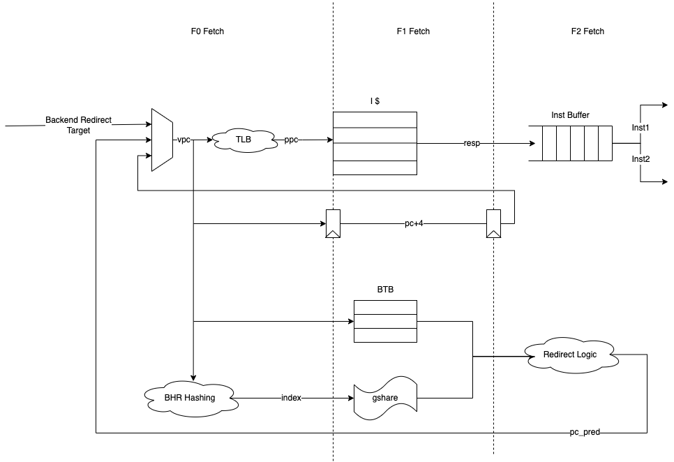

# Fetch Spec

Qiaowen

## Features

* Instructions are fetched from Icache and pushed into a FIFO queue, known as the instruction buffer (2 lines * 16B)
* Bypass is supported when buffer miss, instructions can come directly from new cacheline
* To send requests to Icache, we need to look up tlb
* Looking up the branch target buffer also occurs in this stage, redirecting the fetched instructions as necessary.

### F0 Stage

* pc_gen will generate the correct virtual pc, the pirority is: backend-end redirct target -> predicted pc -> pc+N (decided by poping out 1 or 2 instructions)
  * pc will do hashing with BHR, and get the hash index for Gshare.
  * use pc to index a BTB entry and get pc_pred
* Look up itlb to get physical tag
* Look up instruction buffer
  * if pc is in the IB and valid
    * output 1 or 2 instructions, their rvc, excp signals and valid flags  according to decode's rdy signals and buffer's capacity
    * update pop_ptr and line valid signal
    * send prefetch signal if buffer is not full and next line is not in IB
  * else
    * mark buffer miss
    * mark current line as invalid
    * change pop_ptr to pc's position

### F1 Stage

* If last cycle has req for icache (prefetch or miss), the response cacheline from Icache is put into instruction buffer
  * update line valid signal, excp bits and push_ptr
  * if last cycle miss, do bypass to directly get instructions out at this cycle
* If last cycle buffer hit or branch or encountering other excp signals, do pc->predict_pc

### F2 Stage

* Send correct pc to pc_gen
* In Redirct logic, if Gshare predicts taken, it will sent pc_pred to PC_gen. Otherwise, pc_gen makes no sense.

## Block Diagram

## Interface Definition

| INOUT                             | TYPE&WIDTH                  | DESC                                        |
| --------------------------------- | --------------------------- | ------------------------------------------- |
| clk                               | input                       |                                             |
| reset                             | input                       |                                             |
| branch_valid_first_i              | input                       | first branch valid                          |
| branch_valid_second_i             | input                       | second branch valid                         |
| btb_req_pc_i                      | input PC_WIDTH              | btb req pc from fu                          |
| btb_predict_target_i              | input PC_WIDTH              | btb target pc from fu                       |
| prev_pc_first_i                   | input PC_WIDTH              | last cycle's first pc                       |
| prev_taken_first_i                | input                       | whether last cycle's first pc taken         |
| prev_pc_second_i                  | input PC_WIDTH              | last cycle's second pc                      |
| prev_taken_second_i               | input                       | whether last cycle's second pc taken        |
| pc_first_o                        | output PC_WIDTH             | 1st pc to decode                            |
| next_pc_first_o                   | output PC_WIDTH             | 1st's next pc to decode                     |
| predict_pc_first_o                | output PC_WIDTH             | 1st's predict pc                            |
| instruction_first_o               | output 32                   | 1st inst to decode                          |
| is_rv_first_o                     | output                      | 1st inst is not compressed                  |
| is_first_valid_o                  | output                      | 1st inst is valid to decode                 |
| pc_second_o                       | output PC_WIDTH             | 2nd pc to decode                            |
| next_pc_second_o                  | output PC_WIDTH             | 2nd's next pc to decode                     |
| predict_pc_second_o               | output PC_WIDTH             | 2nd's predict pc                            |
| instruction_second_o              | output 32                   | 2nd inst to decode                          |
| is_rv_second_o                    | output                      | 2nd inst is not compressed                  |
| is_second_valid_o                 | output                      | 2nd inst is valid                           |
| single_rdy_i                      | input                       | decode can take 1 inst                      |
| double_rdy_i                      | input                       | decode can take 2 insts                     |
| real_branch_i                     | input PC_WIDTH              | used when predict miss                      |
| global_wfi_i                      | input                       | global wfi                                  |
| global_ret_i                      | input                       | global ret                                  |
| global_trap_i                     | input                       | global trap                                 |
| global_predict_miss_i             | input                       | global predict miss i                       |
| trap_vector_i                     | input PC_WIDTH              | from csr                                    |
| mret_vector_i                     | input PC_WIDTH              | from csr                                    |
| fetch_l1i_if_req_rdy_i            | input                       | whether icache recv fetch's req             |
| l1i_fetch_if_resp_vld_i           | input                       | whether icache output a valid line to fetch |
| l1i_fetch_if_resp_if_tag_i        | input $clog2(IFQ_DEPTH)     | tag for icache's line                       |
| l1i_fetch_if_resp_data_i          | input FETCH_WIDTH           | one line from icache to fetch               |
| fetch_l1i_if_req_vld_o            | output                      | whether fetch has req to icache             |
| fetch_l1i_if_req_if_tag_o         | output $clog2(IFQ_DEPTH)    | tag for fetch's req                         |
| fetch_l1i_if_req_index_o          | output L1I_INDEX_WIDTH      | pc's index                                  |
| fetch_l1i_if_req_offset_o         | output L1I_OFFSET_WIDTH     | pc's offset                                 |
| fetch_l1i_if_req_vtag_o           | output L1I_TAG_WIDTH        | pc's virtual tag                            |
| fetch_l1i_if_itlb_resp_vld_o      | output                      | itlb valid                                  |
| fetch_l1i_if_itlb_resp_ppn_o      | output PPN_WIDTH            | pc's ppn from itlb                          |
| fetch_l1i_if_itlb_resp_excp_vld_o | output                      | whether itlb has excp                       |
| fetch_l1i_if_itlb_resp_hit_o      | output                      | whether itlb hit                            |
| ins_empty_o                       | output                      | IB is empty                                 |
| exception_valid_first_o           | output                      | exceptions of 1st inst                      |
| ecause_first_o                    | output EXCEPTION_CODE_WIDTH | ecause of 1st inst                          |
| exception_valid_second_o          | output                      | exceptions of 2nd inst                      |
| ecause_second_o                   | output EXCEPTION_CODE_WIDTH | ecause of 2nd inst                          |

