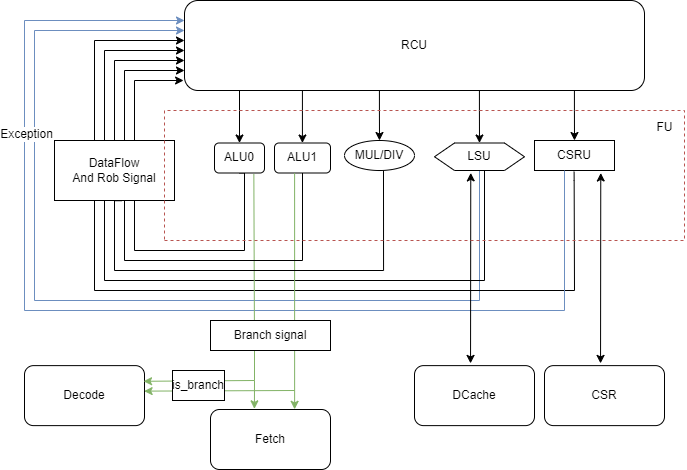

# fu.md

## overview

## interface

### With RCU
#### ALU And MD
| signal                           | I/O | width |                 description                  |
| :------------------------------: | :-: | :---: | :------------------------------------------: |
| rcu_fu_alu1_opr1_i             |  I  |  XLEN      |               alu1 data flow                   |
| rcu_fu_alu1_opr2_i             |  I  |  XLEN      |               alu1 data flow                   |
|  rcu_fu_alu1_rob_index_i             |  I  |  XLEN      |               alu1 data flow                   |
|  rcu_fu_alu1_rd_addr_i      |    I | PHY_REG_ADDR_WIDTH | alu1 data flow | 
|  rcu_fu_alu1_is_branch_i | I | 1 | is branch instr |
|  rcu_fu_alu1_jump_i | I | 1 | is jump instr |
|   rcu_fu_alu1_req_valid_i | I | 1 |  this instr use alu1 |
|   rcu_fu_alu1_half_i   | I | 1 | from decode |
|  rcu_fu_alu1_pc_i   | I | PC_WIDTH | from fetch, just come and leave, not needed in other units | 
| rcu_fu_alu1_next_pc_i | I | PC_WIDTH|  pc_i + 4, if is branch instr and not taken, give it to  pc_out | 
| rcu_fu_alu1_alu_func_sel_i | I | 3 | |
| rcu_fu_alu1_cmp_func_sel_i | I | 3 | |
| rcu_fu_alu1_func_modifier_i | I | 1 | |
|  fu_rcu_alu1_resp_valid_o  | O | 1 | data in alu1 is valid |
|   fu_rcu_alu1_wrb_rob_index_o | O | ROB_INDEX_WIDTH |        |
|   fu_rcu_alu1_wrb_enable_o | O | 1 | need to writeback | 
|  fu_rcu_alu1_alu_wrb_prd_addr_o | O | PHY_REG_ADDR_WIDTH |  | 
|   fu_rcu_alu1_wrb_data_o       |  O | XLEN  |  |
| -------------------------|---|---|-----|---|
| rcu_fu_alu2_opr1_i             |  I  |  XLEN      |               alu2 data flow                   |
| rcu_fu_alu2_opr2_i             |  I  |  XLEN      |               alu2 data flow                   |
|  rcu_fu_alu2_rob_index_i             |  I  |  XLEN      |               alu2 data flow                   |
|  rcu_fu_alu2_rd_addr_i      |    I | PHY_REG_ADDR_WIDTH | alu2 data flow | 
|  rcu_fu_alu2_is_branch_i | I | 1 | is branch instr |
|  rcu_fu_alu2_jump_i | I | 1 | is jump instr |
|   rcu_fu_alu2_req_valid_i | I | 1 |  this instr use alu2 |
| rcu_fu_alu2_req_ready_o   |  O | 1 |    alu2 is ready( always 1) | 
|   rcu_fu_alu2_half_i   | I | 1 | from decode |
|  rcu_fu_alu2_pc_i   | I | PC_WIDTH | from fetch, just come and leave, not needed in other units | 
| rcu_fu_alu2_next_pc_i | I | PC_WIDTH|  pc_i + 4, if is branch instr and not taken, give it to  pc_out | 
| rcu_fu_alu2_alu_func_sel_i | I | 3 | |
| rcu_fu_alu2_cmp_func_sel_i | I | 3 | |
| rcu_fu_alu2_func_modifier_i | I | 1 | |
|  fu_rcu_alu2_resp_valid_o  | O | 1 | data in alu2 is valid |
|   fu_rcu_alu2_wrb_rob_index_o | O | ROB_INDEX_WIDTH |        |
|   fu_rcu_alu2_wrb_enable_o | O | 1 | need to writeback | 
|  fu_rcu_alu2_alu_wrb_prd_addr_o | O | PHY_REG_ADDR_WIDTH |  | 
|   fu_rcu_alu2_wrb_data_o       |  O | XLEN  |  |
|--------------------| --------------| -----------| |
|  rcu_fu_md_oprd1_i |  I | XLEN | to mul/div unit |
|  rcu_fu_md_oprd2_i |  I | XLEN | to mul/div unit |
|  rcu_fu_md_rd_addr_i      |    I | PHY_REG_ADDR_WIDTH-1:0 | alu1 data flow | 
|  rcu_fu_md_rob_index_i             |  I  |  ROB_INDEX_WIDTH|               alu1 data flow                   |
|   rcu_fu_md_req_valid_i | I | 1 |  this instr use md|
| rcu_fu_md_req_ready_o   |  O | 1 | |
| rcu_fu_md_muldiv_i | I | 1 | is mul or div|  //md should solve this signal
| rcu_fu_md_op_i | I | 3 | mul div op code|
|  fu_rcu_md_resp_valid_o  | O | 1 | result in md is valid |
|  fu_rcu_md_resp_ready_i  | I | 1 | rcu is ready for md result | 
|  fu_rcu_md_wb_prd_addr_o | O | PHY_REG_ADDR_WIDTH |  | 
|   fu_rcu_md_wb_data_o       |  O | XLEN  |  |
|   fu_rcu_md_wb_rob_index_o | O | ROB_INDEX_WIDTH |        |
| ---------------------| ----------------|--------------|

#### LSU
|    IO    |       name         |     width      |             description                |
| :------: | :----------------- | :------------- | :------------------------------------- |
| **LSU** | 
| input  | rcu_fu_ls_iss_vld_i | 1 | rcu issue valid |
| input  | rcu_fu_ls_opcode_i | LSU_OPCODE_WIDTH |  |
| input  | rcu_fu_ls_fenced_i | 1 | is this req a fenced req ? |
| input  | rcu_fu_ls_rob_index_i | ROB_INDEX_WIDTH |  |
| input  | rcu_fu_ls_rd_addr_i | PRF_INDEX_WIDTH | |
| output | fu_rcu_ls_ready_o | 1 | |
| output | fu_rcu_ls_rob_finish_o | 1 | |
| output | fu_rcu_ls_rob_index_o | ROB_INDEX_WIDTH | |
| **PRF** | | | |
| input  | rcu_fu_ls_st_data_i | XLEN | store data |
| input  | rcu_fu_ls_virt_addr_i | VIRT_ADDR_LEN | virtual address |
| output | fu_rcu_ls_wb_vld_o | 1 | write back valid | 
| output | fu_rcu_ls_wb_data_o | XLEN | write beck data | 
| **Wakeup** | 
| input | rcu_fu_ls_wake_up_vld_i | 1 | |
| input | rcu_fu_ls_wake_up_index_i | ROB_INDEX_WIDTH | | 
| **Exception** | 
| output | fu_rcu_ls_exception_vld_o | 1 |
| output | fu_rcu_ls_exception_code_o | EXCEPTION_CODE_WIDTH |
| output | fu_rcu_ls_exception_rob_index_o |  ROB_INDEX_WIDTH | 

##### TLB 
Placeholder. check with WC

##### d$
|    IO    |       name         |     width      |             description                |
| :------: | :----------------- | :------------- | :------------------------------------- |
| **load** |
| input  | l1d_ld_req_rdy_i | 1 | <= ls_pipe_l1d_ld_req_rdy_o |
| output | lsu_l1d_ld_req_vld_o | 1 | => ls_pipe_l1d_ld_req_vld_i |
| output | lsu_l1d_ld_req_io_o | 1 | => ls_pipe_l1d_ld_req_io_i |
| output | lsu_l1d_ld_req_rob_index_o | ROB_INDEX_WIDTH | => ls_pipe_l1d_ld_req_rob_tag_i |
| output | lsu_l1d_ld_req_prd_o | PRF_INDEX_WIDTH | => ls_pipe_l1d_ld_req_prd_i **wtf is this**|
| output | lsu_l1d_ld_req_opcode_o | LDU_OP_WIDTH | => ls_pipe_l1d_ld_req_opcode_i |
| output | lsu_l1d_ld_req_index_o | VIRT_ADDR_INDEX_LEN | => ls_pipe_l1d_ld_req_index_i |
| output | lsu_l1d_ld_req_offset_o | ADDR_OFFSET_LEN | => ls_pipe_l1d_ld_req_offset_i |
| output | lsu_l1d_ld_req_vtag_o | L1D_TAG_WIDTH | => ls_pipe_l1d_ld_req_vtag_i **why vtag**|
| **store** | 
| input | lsu_l1d_st_req_rdy_i | 1 | <= ls_pipe_l1d_st_req_rdy_o |
| output | lsu_l1d_st_req_vld_o | 1 | => ls_pipe_l1d_st_req_vld_i |
| output | lsu_l1d_st_req_io_o | 1 | => ls_pipe_l1d_st_req_io_i |
| output | lsu_l1d_st_req_is_fence_o | 1 | => ls_pipe_l1d_st_req_is_fence_i |
| output | lsu_l1d_st_req_rob_index_o | ROB_INDEX_WIDTH | => ls_pipe_l1d_st_req_rob_tag_i |
| output | lsu_l1d_st_req_prd_o | PRF_INDEX_WIDTH | => ls_pipe_l1d_st_req_prd_i **wtf is this**|
| output | lsu_l1d_st_req_opcode_o | STU_OP_WIDTH | => ls_pipe_l1d_st_req_opcode_i |
| output | lsu_l1d_st_req_paddr_o | PHYS_ADDR_LEN | => ls_pipe_l1d_st_req_index_i |
| output | lsu_l1d_st_req_data_o | XLEN | => ls_pipe_l1d_st_req_offset_i |
| **control** | 
| input  | lsu_l1d_ld_req_replay_vld_i | 1 | <= l1d_ls_pipe_ld_replay_valid_o |
| output | lsu_l1d_kill_o | 1 | => ls_pipe_l1d_kill_resp_i |
| input  | lsu_l1d_resp_vld_i | 1 | <= l1d_rob_wb_vld_o |
| input  | lsu_l1d_resp_rob_index_i | ROB_INDEX_WIDTH | <= l1d_rob_wb_rob_tag_o |
| **Writeback** | *to PRF* |
| input  | lsu_l1d_wb_vld_i | 1 | <= l1d_int_prf_wb_vld_o |
| input  | lsu_l1d_wb_rd_addr_i | PRF_INDEX_WIDTH | <= l1d_int_prf_wb_tag_o |
| input  | lsu_l1d_wb_data_i | XLEN | <= l1d_int_prf_wb_data_o |
| **FENCE.I** | *what is Fence.i* |
| output | lsu_l1d_fencei_flush_vld_o | 1 | => fencei_flush_vld_i |
| input  | lsu_l1d_fencei_flush_done_i | 1 | <= fencei_flush_grant_o |

##### Bus 
Placehodler. check with LZX about SOC bus

### with front end
| signal                           | I/O | width |                 description                  |
| :------------------------------: | :-: | :---: | :------------------------------------------: |
|   fu_rcu_br_resp_valid_o      | O | 1 | branch result is valid |
|fu_ft_btb_pc_o| O | VIRTUAL_ADDR_LEN | (ft:fetch)  pc that is currently finished |
| fu_ft_btb_pred_target_pc_o | O | VIRTUAL_ADDR_LEN | pc + offset | 
| fu_ft_alu1_pc_o | O | VIRTUAL_ADDR_LEN | final generated next pc, must be right | 
| gshare_pred_taken_o |  O | 1 | |
| gshare_pred_pc_o | VIRTUAL_ADDR_LEN | from alu_result |
|  fu_ft_alu1br_resp_o      | O | 1 | branch result is valid |
|  fu_dec_alu1br_resp_o     | O | 1 | branch result is valid |