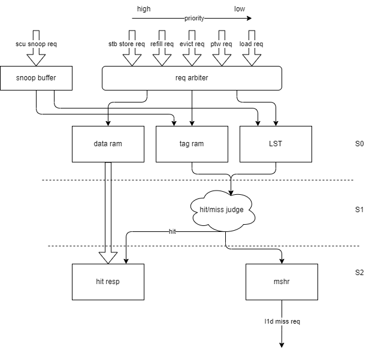

# l1d coherence spec

## 1 interface

### 1.1 cache miss req intf

### 1.2 snoop req intf

## 2 micro architecture support

### 2.1 pipeline diagram

### 2.2 corner cases

  Some detailed corner case specification for snoop.

#### 2.2.1 snoop req conflict with pipeline

  If set idx conflict with valid req in pipeline, stall snoop buffer until no conflict in pipeline, meanwhile backpress all incoming req at s0.

#### 2.2.2 snoop req conflict with mshr

  If set idx conflict with valid req in mshr:
  
  * if the mshr req has handshaked with next level memory, stall snoop buffer until no conflict in mshr, meanwhile backpress all incoming req at s0;
  * else if the mshr req has not hankshaked with next level memory, no snoop req confict.

#### 2.2.3 snoop req conflict with lfb

  No need to check as a valid entry in lfb has to be a valid entry in mshr.

#### 2.2.4 snoop req conflict with ewrq

  If set idx conflict with valid req in ewrq, wait until ewrq finish the evict, meanwhile backpress all incoming req at s0. Than do the snoop.

  For the SCU or next level memory control, if there is a same-line-addr write back req from last level memory which hit a in flight coherent transaction, the write back cache line should be forwarded to the hitted ciherence transaction, take it as the cohernce resp data, and no need to write it into the data ram.

## 3 protocol

  Use MESI protocol, each cache line has one of four states, the cache lines' state is maintained at private cache's line state table(LST) or directory/snoopy filter in shared snoop control unit(SCU)

### 3.1 stable states

| state/attribute | Valid | Dirty | Exclusive |
| --------------- | ----- | ----- | --------- |
| I (Invalid)     | N     | N     | -         |
| SC(SharedClean) | Y     | N     | N         |
| UC(UniqueClean) | Y     | N     | Y         |
| UD(UniqueDirty) | Y     | Y     | Y         |

### 3.2 transient states

<!-- |stete      |  attribute
| -->

### 3.3 messages

#### 3.3.1 request msg

| msg type class | msg type           | description                                                                                                                                              |
| -------------- | ------------------ | -------------------------------------------------------------------------------------------------------------------------------------------------------- |
| requestor req  | ReadNotSharedDirty | Read request to a Snoopable address region to carry out a load from the cache line. Data must be provided to the Requester in UC, UD, or SC states only. |
|                | ReadUnique         |                                                                                                                                                          |
|                | ReadOnce           |                                                                                                                                                          |
|                | CleanUnique        | Request to a Snoopable address region to change the cache state at the Requester to Unique to carry out a store to the cache line.                       |
| evict req      | Evict              |                                                                                                                                                          |
|                | WriteBackFull      |                                                                                                                                                          |
|                | WriteEvictFull     |                                                                                                                                                          |
| scu snoop req  | SnpShared          |                                                                                                                                                          |
|                | SnpUnique          |                                                                                                                                                          |
|                | SnpCleanInvalid    | Snoop request to Invalidate the cache line at the Snoopee and obtain any Dirty copy, used in SF eviction                                                 |

#### 3.3.2 dataless response msg

| msg type class     | msg type     | description                                                                                                                                     |
| ------------------ | ------------ | ----------------------------------------------------------------------------------------------------------------------------------------------- |
| responsor resp     | Comp_I       |                                                                                                                                                 |
|                    | Comp_UC      |                                                                                                                                                 |
|                    | Comp_SC      |                                                                                                                                                 |
| writeback req resp | CompDBIDResp | CopyBack requests' completion response. Comp: WriteData transaction is done. DBIDResp: resources are available to accept the WriteData response |
| snoop resp         | SnpAck       | L1 send to L2 when take the forwarded snoop req from L2                                                                                         |
|                    | SnpResp_I    |                                                                                                                                                 |
|                    | SnpResp_SC   |                                                                                                                                                 |
| resp final ack     | CompAck      | Sent by the Requester on receipt of the Completion response                                                                                     |

#### 3.3.3 data msg

| msg type class      | msg type          | description |
| ------------------- | ----------------- | ----------- |
| responsor resp data | CompData_I        |             |
|                     | CompData_UC       |             |
|                     | CompData_SC       |             |
|                     | CompData_UD_PD    |             |
| copy back req data  | CBWrData_UC       |             |
|                     | CBWrData_SC       |             |
|                     | CBWrData_UD_PD    |             |
|                     | CBWrData_I        |             |
| snoop resp data     | SnpRespData_I     |             |
|                     | SnpRespData_I_PD  |             |
|                     | SnpRespData_SC    |             |
|                     | SnpRespData_SC_PD |             |
|                     | SnpRespData_UC    |             |
|                     | SnpRespData_UD    |             |

### 3.4 states transition

#### 3.4.1 cpu ld/st req fsm

| current state/[output/next state]/input       | default next state                     | default output     | cpu_req_load | cpu_req_store | scu_resp_data_UC         | scu_resp_data_SC         | scu_resp_data_UD         | scu_resp_UD              | scu_SnpShared               | scu_SnpUnique               | scu_SnpCleanInvalid         | refill_evict     |
| --------------------------------------------- | -------------------------------------- | ------------------ | ------------ | ------------- | ------------------------ | ------------------------ | ------------------------ | ------------------------ | --------------------------- | --------------------------- | --------------------------- | ---------------- |
| I                                             | -                                      | -                  | /I_LD_S1     | /I_ST_S1      | -                        | -                        | -                        | -                        | /I_SNP_SHARED_S1            | /I_SNP_UNIQUE_S1            | /I_SNP_CLEANINVALID_S1      | -                |
| I_LD_S1(tag, lst check)                       | I_LD_S2_MISS(miss)                     | -                  | stall input  | stall input   | -                        | -                        | -                        | -                        | stall at snp buf            | stall at snp buf            | stall at snp buf            | -                |
| I_LD_S2_MISS(new mshr)                        | I_LD_IN_MSHR_NOTSENT                   | -                  | stall input  | stall input   | -                        | -                        | -                        | -                        | stall at snp buf            | stall at snp buf            | stall at snp buf            | -                |
| I_LD_IN_MSHR_NOTSENT                          | I_LD_IN_MSHR_SENT                      | ReadNotSharedDirty | stall input  | stall input   | -                        | -                        | -                        | -                        | snp fsm run/I_LD_SNP_STALL  | snp fsm run/I_LD_SNP_STALL  | snp fsm run/I_LD_SNP_STALL  | -                |
| I_LD_IN_MSHR_SENT                             |                                        | -                  | stall input  | stall input   | CompAck/I_UC_DATA_REFILL | CompAck/I_SC_DATA_REFILL | -                        | -                        | stall input                 | stall input                 | stall input                 | -                |
| I_UC_DATA_REFILL                              | UC                                     | load_lsu_resp      | stall input  | stall input   | -                        | -                        | -                        | -                        | stall input                 | stall input                 | stall input                 | -                |
| I_SC_DATA_REFILL                              | SC                                     | load_lsu_resp      | stall input  | stall input   | -                        | -                        | -                        | -                        | stall input                 | stall input                 | stall input                 | -                |
| I_UD_DATA_REFILL                              | UD                                     | -                  | stall input  | stall input   | -                        | -                        | -                        | -                        | stall input                 | stall input                 | stall input                 | -                |
| I_ST_S1(tag, lst check)                       | I_LD_S2_MISS(miss)                     | -                  | stall input  | stall input   | -                        | -                        | -                        | -                        | stall at snp buf            | stall at snp buf            | stall at snp buf            | -                |
| I_ST_S2_MISS(new mshr)                        | I_ST_IN_MSHR_NOTSENT                   | -                  | stall input  | stall input   | -                        | -                        | -                        | -                        | stall at snp buf            | stall at snp buf            | stall at snp buf            | -                |
| I_ST_IN_MSHR_NOTSENT                          | I_ST_IN_MSHR_SENT                      | SendReadUnique     | stall input  | stall input   | -                        | -                        | -                        | -                        | snp fsm run/I_ST_SNP_STALL  | snp fsm run/I_ST_SNP_STALL  | snp fsm run/I_ST_SNP_STALL  | -                |
| I_ST_IN_MSHR_SENT                             |                                        | -                  | stall input  | stall input   | -                        | -                        | CompAck/I_UD_DATA_REFILL | -                        | stall input                 | stall input                 | stall input                 | -                |
| I_SNP_SHARED_S1(tag, lst check)               | I_SNP_x_S2                             | -                  | stall input  | stall input   | -                        | -                        | -                        | -                        | stall input                 | stall input                 | stall input                 | -                |
| I_SNP_UNIQUE_S1(tag, lst check)               | I_SNP_x_S2                             | -                  | stall input  | stall input   | -                        | -                        | -                        | -                        | stall input                 | stall input                 | stall input                 | -                |
| I_SNP_CLEANINVALID_S1(tag, lst check)         | I_SNP_x_S2                             | -                  | stall input  | stall input   | -                        | -                        | -                        | -                        | stall input                 | stall input                 | stall input                 | -                |
| I_SNP_x_S2(snp resp)                          | I                                      | SnpResp_I          | stall input  | stall input   | -                        | -                        | -                        | -                        | stall input                 | stall input                 | stall input                 | -                |
| I_LD_SNP_STALL                                | I_LD_IN_MSHR_NOTSENT(when snp finish)  | -                  | stall input  | stall input   | -                        | -                        | -                        | -                        | stall input                 | stall input                 | stall input                 | -                |
| I_ST_SNP_STALL                                | I_ST_IN_MSHR_NOTSENT(when snp finish)  | -                  | stall input  | stall input   | -                        | -                        | -                        | -                        | stall input                 | stall input                 | stall input                 | -                |
| UC                                            | -                                      | -                  | /UC_LD_S1    | /UC_ST_S1     | -                        | -                        | -                        | -                        | /UC_SNP_SHARED_S1           | /UC_SNP_UNIQUE_S1           | /UC_SNP_CLEANINVALID_S1     | /UC_EVICT_S1     |
| UC_LD_S1(tag, lst check)                      | UC_LD_S2_HIT(hit)                      | -                  | stall input  | stall input   | -                        | -                        | -                        | -                        | stall at snp buf            | stall at snp buf            | stall at snp buf            | stall evict      |
| UC_LD_S2_HIT(hit resp)                        | UC                                     | load_lsu_resp      | stall input  | stall input   | -                        | -                        | -                        | -                        | snp fsm run                 | snp fsm run                 | snp fsm run                 | stall evict      |
| UC_ST_S1(tag, lst check)                      | UC_ST_S2_HIT(hit)                      | -                  | stall input  | stall input   | -                        | -                        | -                        | -                        | stall at snp buf            | stall at snp buf            | stall at snp buf            | stall evict      |
| UC_ST_S2_HIT(wr data, tag ram, lst)           | UD                                     | -                  | stall input  | stall input   | -                        | -                        | -                        | -                        | snp fsm run                 | snp fsm run                 | snp fsm run                 | stall evict      |
| UC_SNP_SHARED_S1(tag, lst check)              | UC_SNP_SHARED_S2                       | -                  | stall input  | stall input   | -                        | -                        | -                        | -                        | stall input                 | stall input                 | stall input                 | stall evict      |
| UC_SNP_SHARED_S2(wr lst; snp resp)            | SC                                     | SnpResp_SC         | stall input  | stall input   | -                        | -                        | -                        | -                        | stall input                 | stall input                 | stall input                 | stall evict      |
| UC_SNP_UNIQUE_S1(tag, lst check)              | UC_SNP_UNIQUE_S2                       | -                  | stall input  | stall input   | -                        | -                        | -                        | -                        | stall input                 | stall input                 | stall input                 | stall evict      |
| UC_SNP_UNIQUE_S2(wr lst; snp resp)            | I                                      | SnpResp_I          | stall input  | stall input   | -                        | -                        | -                        | -                        | stall input                 | stall input                 | stall input                 | stall evict      |
| UC_SNP_CLEANINVALID_S1(tag, lst check)        | UC_SNP_CLEANINVALID_S2                 | -                  | stall input  | stall input   | -                        | -                        | -                        | -                        | stall input                 | stall input                 | stall input                 | stall evict      |
| UC_SNP_CLEANINVALID_S2(wr lst; snp resp)      | I                                      | SnpResp_I          | stall input  | stall input   | -                        | -                        | -                        | -                        | stall input                 | stall input                 | stall input                 | stall evict      |
| UC_EVICT_S1(rd tag, lst; choose way)          | UC_EVICT_S2                            | -                  | stall input  | stall input   | -                        | -                        | -                        | -                        | stall input                 | stall input                 | stall input                 | -                |
| UC_EVICT_S2(wr lst)                           | I                                      | Evict              | stall input  | stall input   | -                        | -                        | -                        | -                        | stall input                 | stall input                 | stall input                 | -                |
| SC                                            | -                                      | -                  | /SC_LD_S1    | /SC_ST_S1     | -                        | -                        | -                        | -                        | /SC_SNP_SHARED_S1           | /SC_SNP_UNIQUE_S1           | /SC_SNP_CLEANINVALID_S1     | /SC_EVICT_S1     |
| SC_LD_S1(tag, lst check)                      | SC_LD_S2_HIT(hit)                      | -                  | stall input  | stall input   | -                        | -                        | -                        | -                        | stall at snp buf            | stall at snp buf            | stall at snp buf            | stall evict      |
| SC_LD_S2_HIT(hit resp)                        | SC                                     | load_lsu_resp      | stall input  | stall input   | -                        | -                        | -                        | -                        | snp fsm run                 | snp fsm run                 | snp fsm run                 | stall evict      |
| SC_ST_S1(tag, lst check)                      | SC_ST_S2_MISS(access)                  | -                  | stall input  | stall input   | -                        | -                        | -                        | -                        | stall at snp buf            | stall at snp buf            | stall at snp buf            | stall evict      |
| SC_ST_S2_MISS                                 | SC_ST_IN_MSHR_NOTSENT                  | -                  | stall input  | stall input   | -                        | -                        | -                        | -                        | stall at snp buf            | stall at snp buf            | stall at snp buf            | stall evict      |
| SC_ST_IN_MSHR_NOTSENT                         | SC_ST_IN_MSHR_SENT                     | CleanUnique        | stall input  | stall input   | -                        | -                        | -                        | -                        | snp fsm run/SC_ST_SNP_STALL | snp fsm run/SC_ST_SNP_STALL | snp fsm run/SC_ST_SNP_STALL | stall evict      |
| SC_ST_IN_MSHR_SENT                            |                                        | -                  | stall input  | stall input   | -                        | -                        | -                        | CompAck/SC_UD_ACC_UPDATE | stall input                 | stall input                 | stall input                 | stall evict      |
| SC_UD_ACC_UPDATE (wr data ram, lst)           | UD                                     | -                  | stall input  | stall input   | -                        | -                        | -                        | -                        | snp fsm run                 | snp fsm run                 | snp fsm run                 | stall evict      |
| SC_SNP_SHARED_S1(tag, lst check)              | SC_SNP_SHARED_S2                       | -                  | stall input  | stall input   | -                        | -                        | -                        | -                        | stall input                 | stall input                 | stall input                 | stall evict      |
| SC_SNP_SHARED_S2(wr lst; snp resp)            | SC                                     | SnpResp_SC         | stall input  | stall input   | -                        | -                        | -                        | -                        | stall input                 | stall input                 | stall input                 | stall evict      |
| SC_SNP_UNIQUE_S1(tag, lst check)              | SC_SNP_UNIQUE_S2                       | -                  | stall input  | stall input   | -                        | -                        | -                        | -                        | stall input                 | stall input                 | stall input                 | stall evict      |
| SC_SNP_UNIQUE_S2(wr lst; snp resp)            | I                                      | SnpResp_I          | stall input  | stall input   | -                        | -                        | -                        | -                        | stall input                 | stall input                 | stall input                 | stall evict      |
| SC_SNP_CLEANINVALID_S1(tag, lst check)        | SC_SNP_CLEANINVALID_S2                 | -                  | stall input  | stall input   | -                        | -                        | -                        | -                        | stall input                 | stall input                 | stall input                 | stall evict      |
| SC_SNP_CLEANINVALID_S2(wr lst; snp resp)      | I                                      | SnpResp_I          | stall input  | stall input   | -                        | -                        | -                        | -                        | stall input                 | stall input                 | stall input                 | stall evict      |
| SC_ST_SNP_STALL                               | SC_ST_IN_MSHR_NOTSENT(when snp finish) | -                  | stall input  | stall input   | -                        | -                        | -                        | -                        | stall input                 | stall input                 | stall input                 | stall evict      |
| SC_EVICT_S1(rd tag, lst; choose way)          | SC_EVICT_S2                            | -                  | stall input  | stall input   | -                        | -                        | -                        | -                        | stall input                 | stall input                 | stall input                 | -                |
| SC_EVICT_S2(wr lst)                           | I                                      | Evict              | stall input  | stall input   | -                        | -                        | -                        | -                        | stall input                 | stall input                 | stall input                 | -                |
| UD                                            | -                                      | -                  | /UD_LD_S1    | /UD_ST_S1     | -                        | -                        | -                        | -                        | /UD_SNP_SHARED_S1           | /UD_SNP_UNIQUE_S1           | /UD_SNP_CLEANINVALID_S1     | /UD_WriteBack_S1 |
| UD_LD_S1(tag, lst check)                      | UD_LD_S2_HIT(hit)                      | -                  | stall input  | stall input   | -                        | -                        | -                        | -                        | stall at snp buf            | stall at snp buf            | stall at snp buf            | stall evict      |
| UD_LD_S2_HIT(hit resp)                        | UD                                     | load_lsu_resp      | stall input  | stall input   | -                        | -                        | -                        | -                        | snp fsm run                 | snp fsm run                 | snp fsm run                 | stall evict      |
| UD_ST_S1(tag, lst check)                      | UD_ST_S2_HIT(hit)                      | -                  | stall input  | stall input   | -                        | -                        | -                        | -                        | stall at snp buf            | stall at snp buf            | stall at snp buf            | stall evict      |
| UD_ST_S2_HIT(wr data, tag ram, lst)           | UD                                     | -                  | stall input  | stall input   | -                        | -                        | -                        | -                        | snp fsm run                 | snp fsm run                 | snp fsm run                 | stall evict      |
| UD_SNP_SHARED_S1(tag, lst check)              | UD_SNP_SHARED_S2                       | -                  | stall input  | stall input   | -                        | -                        | -                        | -                        | stall input                 | stall input                 | stall input                 | stall evict      |
| UD_SNP_SHARED_S2(wr lst; snp data resp)       | SC                                     | SnpRespData_SC_PD  | stall input  | stall input   | -                        | -                        | -                        | -                        | stall input                 | stall input                 | stall input                 | stall evict      |
| UD_SNP_UNIQUE_S1(tag, lst check)              | UD_SNP_UNIQUE_S2                       | -                  | stall input  | stall input   | -                        | -                        | -                        | -                        | stall input                 | stall input                 | stall input                 | stall evict      |
| UD_SNP_UNIQUE_S2(wr lst; snp data resp)       | I                                      | SnpRespData_I_PD   | stall input  | stall input   | -                        | -                        | -                        | -                        | stall input                 | stall input                 | stall input                 | stall evict      |
| UD_SNP_CLEANINVALID_S1(tag, lst check)        | UD_SNP_CLEANINVALID_S2                 | -                  | stall input  | stall input   | -                        | -                        | -                        | -                        | stall input                 | stall input                 | stall input                 | stall evict      |
| UD_SNP_CLEANINVALID_S2(wr lst; snp data resp) | I                                      | SnpRespData_I_PD   | stall input  | stall input   | -                        | -                        | -                        | -                        | stall input                 | stall input                 | stall input                 | stall evict      |
| UD_WriteBack_S1(rd tag ram, lst; choose way)  | UD_WriteBack_S2                        | -                  | stall input  | stall input   | -                        | -                        | -                        | -                        | stall input                 | stall input                 | stall input                 | -                |
| UD_WriteBack_S2(rd data ram)                  | UD_WriteBack_S3                        | CBWrData_UD_PD     | stall input  | stall input   | -                        | -                        | -                        | -                        | stall input                 | stall input                 | stall input                 | -                |
| UD_WriteBack_S3(wr lst)                       | I                                      | -                  | stall input  | stall input   | -                        | -                        | -                        | -                        | stall input                 | stall input                 | stall input                 | -                |

#### 3.4.2 scu snp req fsm

