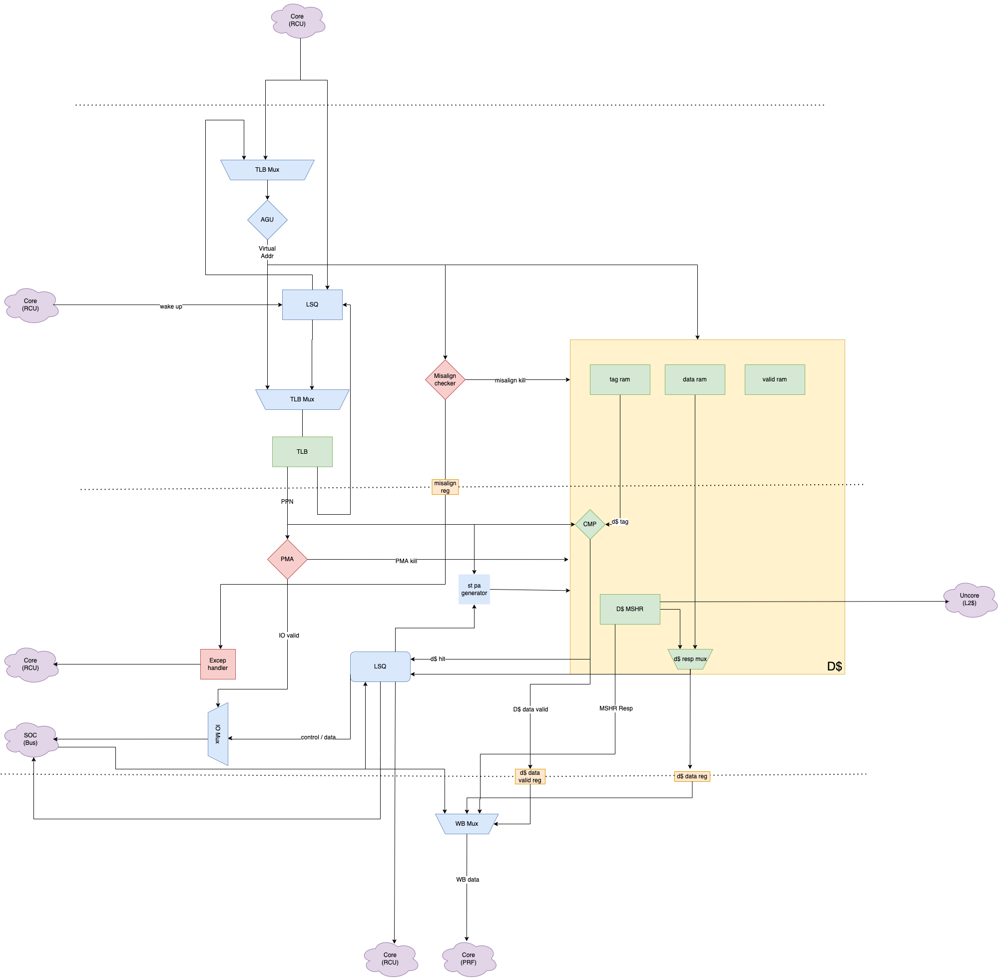

# LSU v0
## Architecture Diagram 


## Prioty
tlb visit prio: new req > LDQ > STQ
send req to d\$ prio: same as tlb visit prio
wbp prio: IO Bus > d\$ resp > ld forwarding


## Pipeline
### S0:
  - VA input AGU, while other fill the LDQ/STQ entry
  - AGU calculates VA
  - check VA misalign
  - VA stand by to read tlb
  - D\$: use VI to read data ram, tag ram, valid ram
### S1: (**very long comb logic**)
  - if misaligned exception happens, send exception to rcu
  - if tlb not hit:
    - VA write back to STQ/LDQ and set is_vir bit to 1
  - if tlb hit:
    - PA write back to LDQ/STQ
    - check PMP with PA. if exception happens: kill the D\$ req and raise an exception to rcu
    - check PMA with PA. if IO, kill the req in D\$ and send req to IO buffef. if IO buffer full, replay the req
    - check ordering failure (RAR in same addr, A-ex and some RAW) or req is store with PA and VA. 
      - If fail or new req is st with STQ & LSQ not empty:
        - set excuted/commited bit 0
        - kill the req in D\$
      - if nothing is wrong :
        - if new req is load:
          - set LDQ entry exec bit 
          - compare tlb output PA's tag and D\$ tag ram output:
            - if D\$ hit: set wb data and wb valid. set LDQ entry succ bit
            - if D\$ miss: 
          - check forwarding. 
            - if success, forward index and forward valid wb to LDQ entry and set wb data and wb valid. 
        - if new req is store:
          - set STQ entry exec bit. 
### S2:
  - write back data  


## A extension
### FENCE
FENCE technically is not an A-ex instruction. 
FENCE is enqued in STQ.

It is pretty easy for STQ/LDQ to give out a fenced ready vector. 
For example, lets take a STQ with vld_vec = 10011111. (lowest bit is entry 0, like 76543210) and fence_vec is 00001010. It is very easy to turn fence_vec to fenced_mask = 00001110, p 

### AMO
aq/rl are all regarded as fence. 

AMO instr are seperated as a load and a store with fence bit is set and points to each other. The former ld in LDQ may be executd first. Once the AMO ld is at head, st in STQ will start to issue.

When both AMO st and AMO ld is at the head of both queue, the AMO operation starts. 
First the AMO ld will be issued. When the resp is sent back, no matter it is from WB or IO, the data will be write back to PRF and to AMO st entry's data field. 
After the AMO ld is commited, AMO st can be treated as a normal ld with fence bit set.

### LR/SC
The STQ keeps issue SC and commit SC and the LDQ keeps commit SC. 
LR/SC is handled by cache. For LSU, LR/SC is like simple ld/st with fence bit set


## submodules
### AGU 
#### design 
a very naive adder. Seems that no need for any dicussion


### TLB
Hooray! Thanks to ZLT for his TLB. 
**need to read his code and interface**


### STQ (Store Queue)
#### entry
| valid | opcode | tag | index | offest | is_virt | rob_index | data | comm | ld_id | fence | fwd_id | fwd_vld |
| ----- | ------ | --- | ----- | ------ | ------- | --------- | ---- | ------- | ----- | ----- | ------ | ------- | 
| entry valid | opcode | tag | index | offset | is tag virtual or not | ROB index | store data | is store commited | the tail of LDQ when this entry is enqued | is this req a fence req? | points to the  LDQ entry which dependend on this entry | is this entry a fwd entry |

- do not reserve a bit for SC, cause cache resp will just wb to rd without informing STQ.
- boom has a STQ entry has a bit for store success. I think there is no difference between success and commit in my circumstance 

#### fence
FENCE are enqued into STQ with a FENCE opcode and fence bit = 1

#### issuing logic
STQ entry can be issued iff:
- iss_pt points to this entry
- entry is valid
- when the req is an IO req, IO buffer is not full; when the req is a mem req, cache is ready
- LDQ issue valid is 0. LDQ has nothing to issue

#### commit logic:
STQ entry can be commit iff:
- it is the head
- comm bit is set
- this entry does not have a forwarding dependency or the LDQ[fwd_id].succ is 1

#### interface
*this part is not a sepercifict. real interface may not be exactly same as this part*
- from RCU: control flows and st data
- to LDQ: send A-related signals
- from LDQ: get A-related signals
- to d$ Mux: a virtual index and a valid
- to TLB Mux: a virtual tag amd a valid
- to Bus: store data
- from Bus: SC success bit *do I really need to set the SC bit? or just write back to prf can do*
- to IO buffer: control bit
- from Searcher: ordering failure that reset the commit bit
- to WB Mux: fwd data


### LDQ (Load Queue)
#### LDQ entry
|   vld  | opcode |  tag  |  index   |  offset   |  is_virt   | rob_index | exec     |  succ     |  order_fail   |  fwd_msk  |  fwd_pd  |  fwd_vld   |  st_id    | fence |
| ------ | ------ | ----- | -------- | --------- | ---------- | ---------- | --------- | --------- | ------------- | --------- | --------- | --------- | --------- | ----- |
| entry valid | opcode | tag, can be virtual or physical | virtual index | offset | is tag virtual or not | ROB index | entry has been executed | entry is successed, for fwd usage | entry order fails, need reply | forwarding data mask | forwarding index in STQ | forwarding valid | the STQ tail when st_id is enqued | is this req a fence req ？|

- boom's LDQ entry has a bit called observed.  no idea what it is.
- order fail bit may not be useful. Because order failure cause replay and replay is based on exec bit equals to 0. So, 

#### harzards
##### RAR hazard 
We must issue loads to a same address in sequencial order.  
The Searcher will find the RAR ordering failure and kill the req in d$. The exec bit will be 0.

RAR hazard is happened iff a former entry:
- has same addr, va or pa
- succ bit is 0

##### RAW hazard
We adopts store data forwarding to solve RAW hazard. There are 2 possible situation for RAW hazard.
###### Store covers Load
The first situation is that the store range can cover the load range. For example, a SW is before a LB and the byte LB load is containrd in the SW data. The Searcher will find this dependency and forward the store entry index to LDQ.
This forwarding process is working only when the store dequeue later than the load. That means when a fence is between the load and its depending store, the bypass may not success. 
Good news is that the loads after a fence req will **not** be issued in anyway, so the false dependency itself is not going to happen.
###### Store does not cover Load
The second situation is that the store range can not cover the load range. For example, a SB is followed by a LD. The Searcher will find this dependency and kill the req in d$. The exec bit will be 0. 

#### issuing logic
A LDQ entry can be issued iff:
- the entry is pointed with issue_pt
- the entry is valid 
- addr is not virtual
- RAR ordering does not fail
- the store entry it points to is not a valid fence store
- when the req is an IO req, IO buffer is not full; when the req is a mem req, cache is ready

**issue pt**
- it points to the head of the ready queue
- every time when issuing a load, check from the head of the ready queue to the tail of the ready queue
- this pt thing works based on a simple assumption: *any entry in the ready queue will not deque until it is issued*. If this assumption is true, using the pt as the head of a so called ready queue is logical correct. To prove this assumption, we should figure out the reason for a entry in LDQ is *not ready*:
    1. *RAR ordering failure*: the later load is depend on one former load. The later load can only be ready when the former load is success. This means that RAR ordering failure can not turn a ready load to unready.
    2. *fence ordering failure*: same as RAR ordering failure, A-ex ordering failure is also a post-dependence ordering failure, which means that A-ex ordering failure also can not turn a ready load to un ready.
    3. *RAW ordering failure*: same as other 2 ordering failre, still is not able to turn a ready load to un ready.

#### success logic
The succ bit will be set when IO resp or cache resp is sent by d$. The bus arbiter makes sure that IO resp and d\$ resp will not be sent in the same time. 
The succ bit will be set when forwarding is valid and both IO and d\$ resp is invalid. 

When the forwarding and resp are both valid, writeback resp first. 

#### commit logic:
The commit is kept in SC.
When both the succ bit and exec bit is set in the head entry of LDQ, commit the head entry. 


#### interface
*this part is not a sepercifict. real interface may not be exactly same as this part*
- issue entry: which entry is to be issued
- commit entry: which entry is to be commited
- fence vec: the vector of all entries whose fence bit is 1. This vec is used for fence ordering failure check and RAW check. 
- RAR vec: addr and is_virt bit is also needed 
- RAW vec: 

### MAC (misalign checker)
pretty straight forward exception.


### PMA (Physical Memory Attributes)
#### design 
physical address mapping router, kind of. 
when PMA check find an PA is a IO mapping addr, kill the req in d\$.
pretty straight forward thing with a fancy name.

```c++
if(PA <= IO_ADDR_LOWER && PA < IO_ADDR_LOWER){
    PMA_kill = 1;
    IO_valid = 1;
}
else{
    PMA_kill = 0;
    IO_valid = 0;
}
```
#### interface
*this part is not a sepercifict. real interface may not be exactly same as this part*
- PA: from TLB
- PMA kill : to cache
- IO valid : to IO Buffer


### PMP (Physical Memory Access)
#### note
PMP entries are described by an 8-bit configuration register and one XLEN-bit address register. For RV64 it is 64 bits
PMP CSRs are only accessible to M-mode.

For RV64, eight even-numbered CSRs, pmpcfg0, pmpcfg2, . . . , pmpcfg14, hold the configurations for the 64 PMP entries. 8 64-bits regs. 8 cfg regs per 64-bits reg.

The PMP address registers are CSRs named pmpaddr0–pmpaddr63. For RV64, each PMP address register encodes bits 55–2 of a 56-bit physical address. Not all physical address bits may be implemented, and so the pmpaddr registers are WARL.\

##### pmpcfg reg:
| L | 0 | A | X | W | R |
| - | - | - | - | - | - |
| 7 | 6 - 5 | 4 - 3 | 2 | 1 | 0 |

##### A 
A = 00, PMP entry is disabled and matches no addresses
A = 01, (TOR) top boundary of an arbitrary range. If TOR is selected, the associated addr reg forms the top of the addr range, while the preceding PMP address register forms the bottom of the address range. If $PMP_i$ A field is set to be TOR, the $pmp_{i-1} \leq addr < pmp_{i}$. If i is 0, then no upper bound is set. 
A = 10, (NA4) naturally aligned four-byte regions. pmpaddr is 4-byte aligned.
A = 11, (NAPOT) Naturally aligned power-of-two region. 
##### L
The L bit indicates that the PMP entry is locked
If PMP entry i is locked, writes to pmpicfg and pmpaddri are ignored.
the L bit indicates whether the R/W/X permissions are enforced on M-mode accesses.
##### priority
PMP entries are statically prioritized. 
The lowest-numbered PMP entry that matches any byte of an access determines whether that access succeeds or fails.

If a PMP entry matches all bytes of an access, then the L, R, W, and X bits determine whether the access succeeds or fails.

If no PMP entry matches an M-mode access, the access succeeds. 
If no PMP entry matches an S-mode or U-mode access, but at least one PMP entry is implemented, the access fails.

Failed accesses generate an instruction, load, or store access-fault exception. 

##### Paging 
When paging is enabled, instructions that access virtual memory may result in multiple physical-memory accesses, including implicit references to the page tables. 
The PMP checks apply to all of these accesses. 
The effective privilege mode for implicit page-table accesses is S.

When the PMP settings are modified, M-mode software must synchronize the PMP settings with the virtual memory system and any PMP or address-translation caches. 
This is accomplished by executing an SFENCE.VMA instruction with rs1=x0 and rs2=x0, after the PMP CSRs are written.

#### design 
just like picorio2's LSU. Credit to ZLT. 


### Searcher 
#### design
Searcher has to handle following jobs:
- Ordering failure:
  - RAR ordering failure
  - RAW ordering failure
  - Fence orderring failure
- forwarding

##### RAR ordering failure
RAR hazard is happened iff a former LDQ entry:
- has same addr, va or pa
- valid is 1
- succ bit is 0

So to check RAR ordering failure, the Searcher need:
- all LDQ entry
- va and pa of this req

##### RAW ordering failure
RAW hazard is happened iff a former STQ entry:
- has same addr, va or pa
- valid is 1
- comm is 0 

So to check RAR ordering failure, the Searcher need:
- all LDQ entry
- va and pa of this req

##### fence ordering failure
Fence hazard is happened iff:
- the ld is pointing to a fence req

### Exception Handler
Just send the exception code with ROB index to RCU

### IO Buffer
An FIFO buffer with a bus controller. 
Connected to the bus directly.

#### IO Buffer entry
| vld | type | id | 
| --- | ---- | -- |
| is this entry  valid ? | load or store | LDQ/STQ entry index | 

#### interface 
- issuing req
- IO valid / type / id

1. SC with a-extend and wake-up
2. store buffer in SC (TSO) with fence
3. store forwarding 

store buffer wake up

# LSU v1
## all features
- SC
- LD lentency == 3
- single LSQ
- VIPT
- IO LD and ST wake-up
  
## new features
- new LSQ
- st and IO ld wakeup
- new opcode for a-ext 
- TLB added 
- reconstruct RTL

## diagram


## wake-up
When issuing requests, LSU will check the awake bit in all store requests and IO load requests. If and only if the awake bit is set to 1, those requests can be issued.
Memory stores can be issued without checking awake bit


## Important Submodules
### LSQ
load queue
#### LSQ entry
| vld | opcode | fenced |  tag  |  index   |  offset  | rob_index | virt | awake | exec | succ |  nxt_opp | nxt_id | rd addr | data | 
| --- | ------ | ----- | ------ | -------- | -------- | --------- | ---- | ----- | ---- | ---- | -------- | ------ | ---- | --- |
| is this entry valid ? | opcode | is this req a fence ? | tag | virtual index | offset | rob_index | is tag virtual? | is this entry awake? | is this entry executed? | is this entry success? | is next req in the opposite que? | the id of next req | data | rd address | 
#### interface 
- RCU: control, data, wake up   |   finish
- IO buffer : vld, index    |   finish
- TLB : VI  |   PT
- d$ : req | finish
- PMA: PA 

## Interface 
### general 
|    IO    |       name         |     width      |             description                |
| :------: | :----------------- | :------------- | :------------------------------------- |
| input | clk | 1 | |
| input | rstn | 1 | low reset |
| input | flush | 1 | |
### RCU 
|    IO    |       name         |     width      |             description                |
| :------: | :----------------- | :------------- | :------------------------------------- |
| **ROB** | 
| input  | rcu_iss_vld_i | 1 | rcu issue valid |
| input  | rcu_lsu_ls_i | 1 | 1 for st and 0 for ld |
| input  | rcu_lsu_ld_opcode_i | LDU_OP_WIDTH | type of ld |
| input  | rcu_lsu_st_opcode_i | STU_OP_WIDTH | type of st |
| input  | rcu_fenced_i | 1 | is this req a fenced req ? |
| input  | rcu_agu_virt_base_i | XLEN | vaddr base, from rs1 |
| input  | rcu_agu_virt_offset_i | XLEN | vaddr offset, from rs2 |
| input  | rcu_rob_index_i | ROB_INDEX_WIDTH |  |
| input  | rcu_rd_addr_i | PRF_INDEX_WIDTH | |
| input  | rcu_lsu_data_i | XLEN | |
| output | lsu_ready_o | 1 | |
| **Finish** | 
| output | lsu_rcu_comm_vld_o | 1 | |
| output | lsu_rcu_comm_rob_index_o | ROB_INDEX_WIDTH | |
| output | lsu_rcu_comm_rd_addr_o | ROB_INDEX_WIDTH | |
| output | lsu_rcu_comm_data_o | ROB_INDEX_WIDTH | |
| **Exception** | 
| output | lsu_exception_vld_o | 1 |
| output | lsu_exception_code_o | EXCEPTION_CODE_WIDTH |
| **Wakeup** | 
| input | rcu_wake_up_vld_i | 1 | |
| input | rcu_wake_up_index_i | ROB_INDEX_WIDTH | | 


### TLB 
|    IO    |       name         |     width      |             description                |
| :------: | :----------------- | :------------- | :------------------------------------- |
| input  | dtlb_lsu_rdy_i | 1 | dtlb is ready or not |
| input  | dtlb_lsu_vld_i | 1 | dtlb response is valid |
| input  | dtlb_lsu_hit_i | 1 |  |
| input  | dtlb_lsu_ptag_i | PHYSICAL_ADDR_TAG_LEN | dtlb ppn resp |
| input  | dtlb_lsu_exception_vld_i | 1 | dtlb exception valid. e.g. pagefault |
| input  | dtlb_lsu_ecause_i | EXCEPTION_CAUSE_WIDTH | dtlb exception cause code |
| output | lsu_dtlb_iss_vld_o | 1 | dtlb request is valid.|
| output | lsu_dtlb_iss_vtag_o | VIRTUAL_ADDR_TAG_LEN | dtlb request vtag out |
| output | lsu_dtlb_iss_type_o | PMP_ACCESS_TYPE_WIDTH | dtlb request type out. R or W or X. For PMP |


### d$
|    IO    |       name         |     width      |             description                |
| :------: | :-----------------                             | :-------------                                                | :------------------------------------- |
| **load** |
| input  | l1d_ld_req_rdy_i                                 | 1                                                             | <= ls_pipe_l1d_ld_req_rdy_o |
| output | lsu_l1d_ld_req_vld_o                             | 1                                                             | => ls_pipe_l1d_ld_req_vld_i |
| output | lsu_l1d_ld_req_io_o                              | 1                                                             | => ls_pipe_l1d_ld_req_io_i |
| output | lsu_l1d_ld_req_rob_index_o                       | ROB_INDEX_WIDTH                                               | => ls_pipe_l1d_ld_req_rob_tag_i |
| output | lsu_l1d_ld_req_prd_o                             | PRF_INDEX_WIDTH                                               | => ls_pipe_l1d_ld_req_prd_i |
| output | lsu_l1d_ld_req_opcode_o                          | LDU_OP_WIDTH                                                  | => ls_pipe_l1d_ld_req_opcode_i |
| output | lsu_l1d_ld_req_index_o                           | VIRT_ADDR_INDEX_LEN                                           | => ls_pipe_l1d_ld_req_index_i |
| output | lsu_l1d_ld_req_offset_o                          | ADDR_OFFSET_LEN                                               | => ls_pipe_l1d_ld_req_offset_i |
| output | lsu_l1d_ld_req_vtag_o                            | L1D_TAG_WIDTH                                                 | => ls_pipe_l1d_ld_req_vtag_i |
| **store** |           
| input | lsu_l1d_st_req_rdy_i                              | 1                                                             | <= ls_pipe_l1d_st_req_rdy_o |
| output | lsu_l1d_st_req_vld_o                             | 1                                                             | => ls_pipe_l1d_st_req_vld_i |
| output | lsu_l1d_st_req_io_o                              | 1                                                             | => ls_pipe_l1d_st_req_io_i |
| output | lsu_l1d_st_req_is_fence_o                        | 1                                                             | => ls_pipe_l1d_st_req_is_fence_i |
| output | lsu_l1d_st_req_rob_index_o                       | ROB_INDEX_WIDTH                                               | => ls_pipe_l1d_st_req_rob_tag_i |
| output | lsu_l1d_st_req_prd_o                             | PRF_INDEX_WIDTH                                               | => ls_pipe_l1d_st_req_prd_i |
| output | lsu_l1d_st_req_opcode_o                          | STU_OP_WIDTH                                                  | => ls_pipe_l1d_st_req_opcode_i |
| output | lsu_l1d_st_req_paddr_o                           | PHYS_ADDR_LEN                                                 | => ls_pipe_l1d_st_req_index_i |
| output | lsu_l1d_st_req_data_o                            | XLEN                                                          | => ls_pipe_l1d_st_req_offset_i |
| **control** |             
| input  | lsu_l1d_ld_req_replay_vld_i                      | 1                                                             | <= l1d_ls_pipe_ld_replay_valid_o |
| output | lsu_l1d_kill_o                                   | 1                                                             | => ls_pipe_l1d_kill_resp_i |
| **Writeback** | 
| input  | l1d_lsu_wb_vld_i                                 | LSU_ADDR_PIPE_COUNT + LSU_DATA_PIPE_COUNT                     | <= l1d_rob_wb_vld_o |
| input  | l1d_lsu_wb_rob_index_i                           | (LSU_ADDR_PIPE_COUNT + LSU_DATA_PIPE_COUNT) * ROB_INDEX_WIDTH | <= l1d_rob_wb_rob_tag_o |
| input  | l1d_lsu_prf_wb_vld_i                             | LSU_DATA_PIPE_COUNT                                           | <= l1d_int_prf_wb_vld_o |
| input  | l1d_lsu_prf_wb_rd_addr_i                         | PHY_REG_ADDR_WIDTH * LSU_DATA_PIPE_COUNT                      | <= l1d_int_prf_wb_tag_o |
| input  | l1d_lsu_prf_wb_data_i                            | XLEN*LSU_DATA_PIPE_COUNT                                      | <= l1d_int_prf_wb_data_o |

### Bus (WishBone)
|    IO    |       name         |     width      |             description                |
| :------: | :----------------- | :------------- | :------------------------------------- |
| output | lsu_wb_cyc_o | 1 |  |
| output | lsu_wb_stb_o | 1 |  |
| output | lsu_wb_we_o | 1 |  |
| output | lsu_wb_adr_o | PHYSICAL_ADDR_LEN |  |
| output | lsu_wb_dat_o | WB_DATA_LEN |  |
| output | lsu_wb_sel_o | WB_DATA_LEN / 8 |  |
| input | wb_lsu_ack_i | 1 |  |
| input | wb_lsu_dat_i | WB_DATA_LEN |  |

# LSU v2