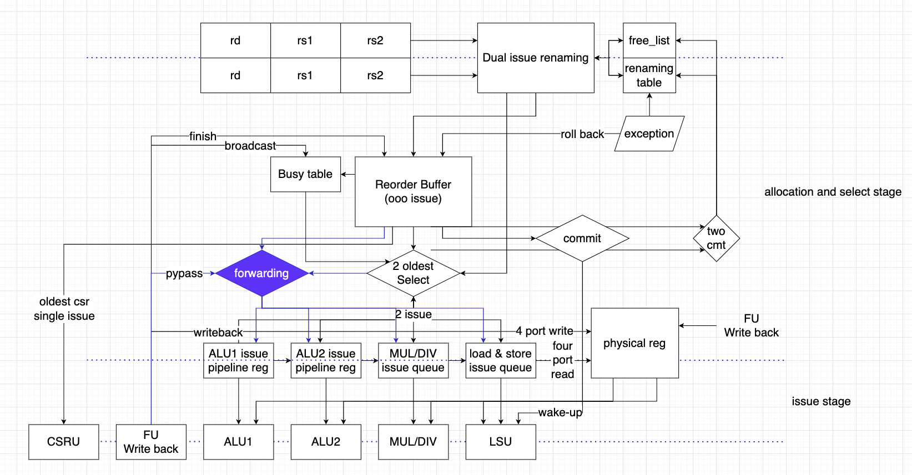
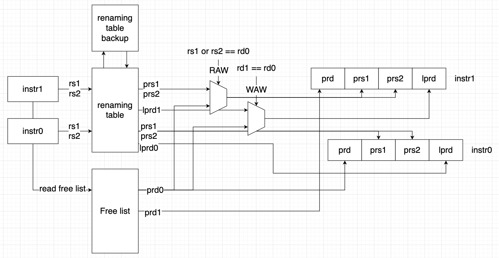

# RCU Spec

## version history
| Revision Number | Author      | Date       | Description |
| --------------- | ----------- | ---------- | ----------- |
| 1.0             | Yihai Zhang | 2022.10.06 | init        |

## overview

## interface
### with decode
| signal                           | I/O |    width     |                 description                  |
| :------------------------------: | :-: | :----------: | :------------------------------------------: |
| uses_rs1_first_i                 |  I  |      1       |                   use rs1                    |
| uses_rs1_second_i                |  I  |      1       |                   use rs1                    |
| uses_rs2_first_i                 |  I  |      1       |                   use rs2                    |
| uses_rs2_second_i                |  I  |      1       |                   use rs2                    |
| uses_rd_first_i                  |  I  |      1       |                    use rd                    |
| uses_rd_second_i                 |  I  |      1       |                    use rd                    |
| uses_csr_first_i                 |  I  |      1       |                   use csr                    |
| uses_csr_second_i                |  I  |      1       |                   use csr                    |
| pc_first_i                       |  I  |   PC_WIDTH   |                  current pc                  |
| pc_second_i                      |  I  |   PC_WIDTH   |                  current pc                  |
| next_pc_first_i                  |  I  |   PC_WIDTH   |                 the next pc                  |
| next_pc_second_i                 |  I  |   PC_WIDTH   |                 the next pc                  |
| rs1_address_first_i              |  I  |      5       |             decode field to rob              |
| rs1_address_second_i             |  I  |      5       |             decode field to rob              |
| rs2_address_first_i              |  I  |      5       |             decode field to rob              |
| rs2_address_second_i             |  I  |      5       |             decode field to rob              |
| rd_address_first_i               |  I  |      5       |             decode field to rob              |
| rd_address_second_i              |  I  |      5       |             decode field to rob              |
| csr_address_first_i              |  I  |     12       |             decode field to rob              |
| csr_address_second_i             |  I  |     12       |             decode field to rob              |
| mret_first_i                     |  I  |      1       |            mret instruction flag             |
| mret_second_i                    |  I  |      1       |            mret instruction flag             |
| sret_first_i                     |  I  |      1       |            sret instruction flag             |
| sret_second_i                    |  I  |      1       |            sret instruction flag             |
| wfi_first_i                      |  I  |      1       |             wfi instruction flag             |
| wfi_second_i                     |  I  |      1       |             wfi instruction flag             |
| ecause_first_i                   |  I  |      4       |                exception code                |
| ecause_second_i                  |  I  |      4       |                exception code                |
| exception_first_i                |  I  |      1       |                exception flag                |
| exception_second_i               |  I  |      1       |                exception flag                |
| half_first_i                     |  I  |      1       |             decode field to rob              |
| half_second_i                    |  I  |      1       |             decode field to rob              |
| is_fence_first_i                 |  I  |      1       |            fence instruction flag            |
| is_fence_second_i                |  I  |      1       |            fence instruction flag            |
| fence_op_first_i                 |  I  |      2       |             fence function code              |
| fence_op_second_i                |  I  |      2       |             fence function code              |
| is_aext_first_i                  |  I  |      1       |         A extension instruction flag         |
| is_aext_second_i                 |  I  |      1       |         A extension instruction flag         |
| is_mext_first_i                  |  I  |      1       |         M extension instruction flag         |
| is_mext_second_i                 |  I  |      1       |         M extension instruction flag         |
| deco_rob_req_valid_first_i       |  I  |      1       |                  valid flag                  |
| deco_rob_req_valid_second_i      |  I  |      1       |                  valid flag                  |
| deco_rob_req_ready_first_o       |  O  |      1       |             get the ready signal             |
| deco_rob_req_ready_second_o      |  O  |      1       |             get the ready signal             |
| csr_read_first_i                 |  I  |      1       |               csr read signal                |
| csr_read_second_i                |  I  |      1       |               csr read signal                |
| csr_write_first_i                |  I  |      1       |               csr write signal               |
| csr_write_second_i               |  I  |      1       |               csr write signal               |
| imm_data_first_i                 |  I  |     32       |            immediate operand to fu           |
| imm_data_second_i                |  I  |     32       |            immediate operand to fu           |
| fu_function_first_i              |  I  |      3       |               fu function code               |
| fu_function_second_i             |  I  |      3       |               fu function code               |
| alu_function_modifier_first_i    |  I  |      1       |         sub and sra indicator for alu        |
| alu_function_modifier_second_i   |  I  |      1       |         sub and sra indicator for alu        |
| fu_select_a_first_i              |  I  |      2       |        fu selection code for operand a       |
| fu_select_a_second_i             |  I  |      2       |        fu selection code for operand a       |
| fu_select_b_first_i              |  I  |      2       |        fu selection code for operand b       |
| fu_select_b_second_i             |  I  |      2       |        fu selection code for operand b       |
| jump_first_i                     |  I  |      1       |                to rob branch                 |
| jump_second_i                    |  I  |      1       |                to rob branch                 |
| branch_first_i                   |  I  |      1       |                to rob branch                 |
| branch_second_i                  |  I  |      1       |                to rob branch                 |
| is_alu_first_i                   |  I  |      1       |                 to rob (lsu)                 |
| is_alu_second_i                  |  I  |      1       |                 to rob (lsu)                 |
| load_first_i                     |  I  |      1       |            load operation indicator          |
| load_second_i                    |  I  |      1       |            load operation indicator          |
| store_first_i                    |  I  |      1       |           store operation indicator          |
| store_second_i                   |  I  |      1       |           store operation indicator          |
| ldu_op_first_i                   |  I  | LDU_OP_WIDTH |          load operation code for lsu         |
| ldu_op_second_i                  |  I  | LDU_OP_WIDTH |          load operation code for lsu         |
| stu_op_first_i                   |  I  | STU_OP_WIDTH |         store operation code for lsu         |
| stu_op_second_i                  |  I  | STU_OP_WIDTH |         store operation code for lsu         |
| aq_first_i                       |  I  |      1       |         aq bit in atomic instructions        |
| aq_second_i                      |  I  |      1       |         aq bit in atomic instructions        |
| rl_first_i                       |  I  |      1       |         rl bit in atomic instructions        |
| rl_second_i                      |  I  |      1       |         rl bit in atomic instructions        |
### with fu
| signal                           | I/O | width |                 description                  |
| :------------------------------: | :-: | :---: | :------------------------------------------: |
| rob_index_alu1_back_i            |  I  |  ROB_INDEX_WIDTH  |               FU write back to rob                   |
| rob_index_alu2_back_i            |  I  |  ROB_INDEX_WIDTH  |               FU write back to rob                   |
| rob_index_csru_back_i            |  I  |  ROB_INDEX_WIDTH  |               FU write back to rob                   |
| rob_index_lsu_back_i             |  I  |  ROB_INDEX_WIDTH  |               FU write back to rob                   |
| rob_index_md_back_i              |  I  |  ROB_INDEX_WIDTH  |               FU write back to rob                   |
| physical_alu1_wrb_addr_i         |  I  |  PHY_REG_ADDR_WIDTH   |               FU write back to prf & tag             |
| physical_alu2_wrb_addr_i         |  I  |  PHY_REG_ADDR_WIDTH   |               FU write back to prf & tag             |
| physical_csru_wrb_addr_i         |  I  |  PHY_REG_ADDR_WIDTH   |               FU write back to prf & tag             |
| physical_lsu_wrb_addr_i          |  I  |  PHY_REG_ADDR_WIDTH   |               FU write back to prf & tag             |
| physical_md_wrb_addr_i           |  I  |  PHY_REG_ADDR_WIDTH   |               FU write back to prf & tag             |
| physical_alu1_wrb_data_i         |  I  |  XLEN   |               FU write back to prf                   |
| physical_alu2_wrb_data_i         |  I  |  XLEN   |               FU write back to prf                   |
| physical_csru_wrb_data_i         |  I  |  XLEN   |               FU write back to prf                   |
| physical_lsu_wrb_data_i          |  I  |  XLEN   |               FU write back to prf                   |
| physical_md_wrb_data_i           |  I  |  XLEN   |               FU write back to prf                   |
| physical_alu1_wrb_valid_i        |  I  |   1   |               FU write back to prf tag               |
| physical_alu2_wrb_valid_i        |  I  |   1   |               FU write back to prf tag               |
| physical_csru_wrb_valid_i        |  I  |   1   |               FU write back to prf tag               |
| physical_lsu_wrb_valid_i         |  I  |   1   |               FU write back to prf tag               |
| physical_md_wrb_valid_i          |  I  |   1   |               FU write back to prf tag               |
| func_lsu_ready_i                 |  I  |   1   |               FU lsu ready sigal                     |
| func_md_ready_i                  |  I  |   1   |               FU md ready sigal                      |
| func_alu1_ready_i                |  I  |   1   |               fake port                              |
| func_alu2_ready_i                |  I  |   1   |               fake port                              |
| func_csru_ready_i                |  I  |   1   |               fake port                              |
| func_wrb_lsu_exp_i               |  I  |   1   |               FU lsu exp back to rob                 |
| func_wrb_md_exp_i                |  I  |   1   |               fake port                              |
| func_wrb_alu1_exp_i              |  I  |   1   |               fake port                              |
| func_wrb_alu2_exp_i              |  I  |   1   |               fake port                              |
| func_wrb_csru_exp_i              |  I  |   1   |               FU csru exp back to rob                |
| func_wrb_lsu_ecause_i            |  I  |   4   |               FU lsu ecause back to rob              |
| func_wrb_md_ecause_i             |  I  |   4   |               fake port                              |
| func_wrb_alu1_ecause_i           |  I  |   4   |               fake port                              |
| func_wrb_alu2_ecause_i           |  I  |   4   |               fake port                              |
| func_wrb_csru_ecause_i           |  I  |   4   |               FU csru ecause back to rob             |
| rob_iss_lsu_valid_o              |  O  |   1   |               valid signal to FU             |
| rob_iss_alu1_valid_o             |  O  |   1   |               valid signal to FU             |
| rob_iss_alu2_valid_o             |  O  |   1   |               valid signal to FU             |
| rob_iss_md_valid_o               |  O  |   1   |               valid signal to FU             |
| rob_iss_csru_valid_o             |  O  |   1   |               valid signal to FU             |
| rob_iss_alu1_op1_data_o          |  O  |   XLEN   |               rs             |  [m]
| rob_iss_alu1_op2_data_o          |  O  |   XLEN   |               rs             |
| rob_iss_alu2_op1_data_o          |  O  |   XLEN   |               rs             |
| rob_iss_alu2_op2_data_o          |  O  |   XLEN   |               rs             |
| rob_iss_md_op1_data_o            |  O  |   XLEN   |               rs             |
| rob_iss_md_op2_data_o            |  O  |   XLEN   |               rs             |
| rob_iss_lsu_op1_data_o           |  O  |   XLEN   |               rs             |
| rob_iss_lsu_op2_data_o           |  O  |   XLEN   |               rs             |
remaining ...

### with exception ctrl
| signal                           | I/O | width |                 description                  |
| :------------------------------: | :-: | :---: | :------------------------------------------: |
| global_wfi_i                     |  I  |   1   |                 global crtl                  |
| global_trap_i                    |  I  |   1   |                 global crtl                  |
| global_mret_i                    |  I  |   1   |                 global crtl                  |

## renaming table & free list
### overview

### renaming table
* handle RAW and WAW harzard
* 32 entry
* maintain a snapshot of renaming table update when instruction commit

### free list
* FIFO Depth = 48
* when the destination of register is 0, it will not be mapped in free list and the corresponding physical address is 0 (rd = 0, prd = 0)
* maintain a first read pointer moving forward when instrution need to be renamed (rd != 0)
* maintain a write pointer moving when instruction commit and write back last prd
* maintain a second read pointer moving forward when instrution commit

## physical register
* size = 48
* 64 bits 
* read port = 4
* write port = 4 
  * alu1 and csru write back the same port

## available table
* size = 48
* 1 bit
* indicates the valid state of physical register
* write 1 when fu finish
* write 0 when commit 

## enter policy
* handshake with decode
* no global_speculate_fault
* no wfi
* * FIXME second write entry does not care about if first write failed

## issue policy
* in rob:
  * rob entry valid
  * source reg available
  * have not issued
  * load store instruction: lsuq two elements empty remaining
  * md instruction: mdq two elements empty remining
  * the oldest csr instruction
  * no exception before rcu module
  * no mret, sret, wfi signal
* support bypass from input

## commit policy
* first commit
  * rob first entry valid
  * fu wrb first finish
  * no wfi
* second commit
  * first commit valid
  * rob second entry valid
  * fu wrb second finish
  * first and second entry have no predict miss
  * first and second entry have no exception

## issue queue
* four issue queue: first alu issue queue, second alu issue queue, MUL/DIV issue queue, load/store issue queue
* queue description
  * alu issue queue is a pipeline register beacause alu is a always ready function unit and excute in one cycle
  * MUL/DIV queue is a FIFO with two port in and one port out
  * load/store issue queue is a FIFO with one in and one out

## exception(return and predict miss) & roll back
* exception raised by frontend will not issue (skip signal -> finish directly) 
1. handle excetion when commit
2. renaming table
    roll back from snapshot when exception
3. rob
   1. flush rob use ctrl
   2. rob selected ctrl
   3. rob exception ctrl & cause 
   4. branch taken signal
   5. predict miss signal
   6. rob finish ctrl
   7. write pointer reset to 0
   8. commit pointer reset to 0
4. freelist
    maintain a slower read pointer moved when commit while a normal read pointer move forward when instr writed in rob