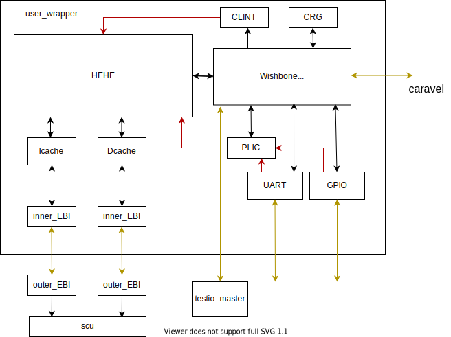
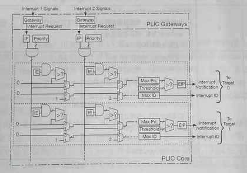
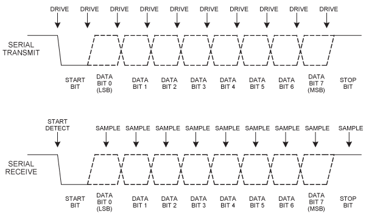
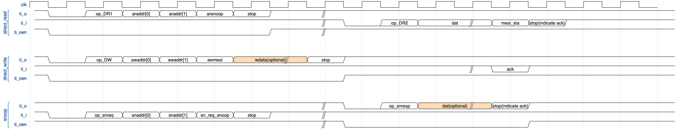

# SOC

## Diagram

## BUS
    GreenRio uses wishbone bus as on-chip bus.
|port   | description|
| :---: | :---------:|
|cyc	| indicates that a valid bus cycle is in progress. |
|stb	| chipselect: indicates a valid data transfer cycle. |
|we	    | indicates whether the current local bus cycle is a READ or WRITE cycle.|
|ack	| indicates the termination of a normal bus cycle by slave device.|
|sel    | select which byte is effective. | 
|wdata  | the data to be written to slave machine. |
|rdata  | read data responsed by slave machine. |
|addr   | indicates the target address to be read / written. |

See detaild introduction in [WISHBONE SoC INterconnection Architecture for Portable IP Cores](https://cdn.opencores.org/downloads/wbspec_b4.pdf).
## CLINT (Core Local Interruptor)
### interface
|    IO    |       name         |     width      |             description                |
| :------: | :----------------- | :------------- | :------------------------------------- |
| output  | clint_core_tmr_irq_o | 1 | timer interrupt |
| output  | clint_core_soft_irq_o | 1 | software interrupt |
| input   | wbm_clint_cyc_i | 1 | |
| input   | wbm_clint_stb_i | 1 |  |
| input   | wbm_clint_addr_i | WB_AD_WIDTH |  |
| input   | wbm_clint_wdata_i | WB_DAT_WIDTH |  |
| input   | wbm_clint_we_i | 1 | 0:read   1:write |
| input   | wbm_clint_sel_i | WB_DAT_WIDTH/8| |
| output  | clint_wbm_rdata_o | WB_DAT_WIDTH |  |
| output   | clint_wbm_ack_o | 1 |  |

### registers
|    register    |   address   |    description                |
| :------: | :---------- | :------------------- | 
| mtimecmp  | 0x0200_0000  | if mtime > mtimecmp, trigger machine timer interrupt |
| stimecmp  | 0x0200_0020  | if stime > stimecmp, trigger supervisor timer interrupt |
| mtime | 0x0200_0008 | count time (synchronous with core) |
| stime | 0x0200_0028 | count time (synchronous with core) |
| msip | 0x0200_0010 | if msip[0] is written 1, generate machine software interrupt |
| ssip | 0x0200_0030 | if ssip[0] is written 1, generate supervisor software interrupt |

    Note that in RISC-V specification the width of mtime and mtimecmp is 64bit.

## PLIC(Platform-Level Interrupt Controller)
### diagram

### interface
|    IO    |       name         |     width      |             description                |
| :------: | :----------------- | :------------- | :------------------------------------- |
| output  | plic_core_ext_irq_o | 1 | external interrupt for core |
| input  | gpio_plic_irq_i | 1 | GPIO's interrupt instruction |
| input   | uart_plic_irq_i | 1 |UART's interrupt instruction |
| input   | wbm_plic_cyc_i | 1 | |
| input   | wbm_plic_stb_i | 1 |  |
| input   | wbm_plic_addr_i | WB_AD_WIDTH |  |
| input   | wbm_plic_wdata_i | WB_DAT_WIDTH |  |
| input   | wbm_plic_we_i | 1 | 0:read   1:write |
| input   | wbm_plic_sel_i | WB_DAT_WIDTH/8| |
| output  | plic_wbm_rdata_o | WB_DAT_WIDTH |  |
| output   | plic_wbm_ack_o | 1 |  |
### registers
|    register    |   address   |    description                |
| :------: | :---------- | :------------------- | 
| uart_priority  | 0x0200_0100 | High priority interrupt can be issued first. |
| gpio_priority  | 0x0200_0104 |  |
| uart_ip | 0x0200_0108 | After one interrupt issued， its corresponding IP register rises, until core read interrupt interrupt source identification to pull down it. |
| gpio_ip | 0x0200_010c |  |
| irq_threshold | 0x0200_0110 | if interrupt priority is higher than that value, then interrupt can be issued. |
| irq_response | 0x0200_0114 | Core generates a read request for this register to response external interrupt, value is interrupt source's ID|
| irq_complete | 0x0200_0118 | After core handle present interrupt, it will write corresponding ID to this register to release corresponding gateway. |
| uart_en | 0x0200_011c | interrupt enable |
| gpio_en | 0x0200_0120 |  |
    In oder to remove clint interrupt, need to remove the interrupt source's trap first.

### ID
    gpio : 2
    uart : 1

## GPIO
### interface
|    IO    |       name         |     width      |             description                |
| :------: | :----------------- | :------------- | :------------------------------------- |
| input   | wbm_gpio_cyc_i | 1 | |
| input   | wbm_gpio_stb_i | 1 |  |
| input   | wbm_gpio_addr_i | WB_AD_WIDTH |  |
| input   | wbm_gpio_wdata_i | WB_DAT_WIDTH |  |
| input   | wbm_gpio_e_i | 1 | 0:read   1:write |
| input   | wbm_gpio_sel_i | WB_DAT_WIDTH/8| |
| output  | gpio_wbm_rdata_o | WB_DAT_WIDTH |  |
| output   | gpio_wbm_ack_o | 1 |  |
| output  | gpio_plic_irq_o | 1 |  |
| input   | gpio_in_i | 1 | | |
| output   | gpio_out_o | 1 | |

### registers
|    register    |   address   |    description         |
| :------: | :---------- | :------------------- | 
| GPIO_VALUE_ADDR  | 0x0200_0200 |  |
|  GPIO_INPUT_EN_ADDR | 0x0200_0204 | [0]: input enable (if input enable is off, GPIO is in output mode)  [1]: interrupt enable |
| GPIO_PORT_ADDR | 0x0200_0208 |  |
### interrupt mechanism
    If input_enable is on and an edge change is detected, triggering an interrupt.

## UART
### interface
|    IO    |       name         |     width      |             description                |
| :------: | :----------------- | :------------- | :------------------------------------- |
| output  | uart_tx_o | 1 |  |
| input  | uart_rx_i | 1 |  |
| input   | wbm_uart_cyc_i | 1 | |
| input   | wbm_uart_stb_i | 1 |  |
| input   | wbm_uart_addr_i | WB_AD_WIDTH |  |
| input   | wbm_uart_wdata_i | WB_DAT_WIDTH |  |
| input   | wbm_uart_we_i | 1 | 0:read   1:write |
| input   | wbm_uart_sel_i | WB_DAT_WIDTH/8| |
| output  | uart_wbm_rdata_o | WB_DAT_WIDTH |  |
| output   | uart_wbm_ack_o | 1 |  |
| output  | uart_plic_irq_o | 1 |  |

### registers
|    register    |   address   |    description         |
| :------: | :---------- | :------------------- | 
| UART_TX_DATA_ADDR  | 0x0200_0300 | [7:0] is used   write to this address to fill the byte to be sent by  |
|  UART_RX_DATA_ADDR | 0x0200_0304 | [7:0] is used |
| UART_TX_CTRL_ADDR | 0x0200_0308 | [2] output interrupt enable   [1] 1 - two bit stop; 0 - one bit stop   [0] output enable |
| UART_RX_CTRL_ADDR | 0x0200_030c | [31:29] control interrupt watermark   [28:26] elements number in read_fifo   [2] input interrupt enable   [0] input enable |
### message structure

    baud rate is 115200
    Parity code is even parity check. For example: tx_data = 8'b11110000, parity_code = 1'b0
    The send buffer's depth and receive buffer's depth are both 8. 
    If the send buffer is full and still write to UART_TX_DATA_ADDR, the data in front slot will be discard.
    If the receive buffer is full and the position machine still sends message to UART, the data can't be received.
### interrupt mechanism
If the elem number in output_fifo is less than tx_ctrl[18:16], trigger an interrupt. 
If the elem number in input_fifo is less than rx_ctrl[18:16], trigger an interrupt.
### CRG

### interface
|    IO    |       name         |     width      |             description                |
| :------: | :----------------- | :------------- | :------------------------------------- |
| input  |  async_reset_i  |  1  |   | 
| input  |  external_clk_i  |  1  |   |
| output |  global_clk_o    |   1  |   |
| output |  ebi_clk_o    |   1  |   |
| output |  core_reset_o  |   1  |   |
| output  |  perips_reset_o  |  1  |   | 
| input   | wbm_crg_cyc_i | 1 | |
| input   | wbm_crg_stb_i | 1 |  |
| input   | wbm_crg_addr_i | WB_AD_WIDTH |  |
| input   | wbm_crg_wdata_i | WB_DAT_WIDTH |  |
| input   | wbm_crg_we_i | 1 | 0:read   1:write |
| input   | wbm_crg_sel_i | WB_DAT_WIDTH/8| |
| output  | crg_wbm_rdata_o | WB_DAT_WIDTH |  |

### registers
|    register    |   address   |    description         |
| :------: | :---------- | :------------------- | 
| CRG_CTRL_ADDR  | 0x0200_0400 | [3:0] domain1~4 clock enable   [7:4] domain1~4 reset signal |
    Domain1: hehe, cache, clint, plic
    Domain2: uart
    Domain3: gpio
    Domain4: ebi
    Global config: testio, wb_interconnect, crg

## EBI

EBI is used for forwarding ACE bus transactions to off-chip part(SCU, L2 Cache etc).
### diagram

### Message structure

### interface
|    IO    |       name         |     width      |             description                |
| :------: | :----------------- | :------------- | :------------------------------------- |
| ...  | l2_req_if_arready_o,  l2_req_if_arvalid_i   ...  |    | Port connected with Cache is same as SCU's | 
| input  |  ebi_i  |  16  |  accept the message from external ebi |
| output |  ebi_o    |   16  |  send messages to external ebi |
| output |  ebi_oen    |   16  | control the I/O mode of connected GPIO port  |
| input |  bus_switch_i  |   1  | When internal ebi accquire the ebi_bus, and external ebi needs to raise a request. External ebi needs to send a request through this channel to get the control of ebi_bus.  |
| output  |  bus_siwtch_o  |  1  | When internal ebi release the ebi_bus, and needs to raise a request(read or write). It needs to send a request through this channel to get the control of ebi_bus.  | 
|output | bus_switch_oen | 1 | control the I/O mode of bus_switch channel's connected GPIO port |

### state transition

#### read process
`IDLE` -> `SEND_AR` -> `WAIT_R` -> `RECV_R` -> `RESP_R` -> `IDLE`

| original state | new state | transiting condition|
| :----: | :-------: | :-------: |
|IDLE | SEND_AR | Ebi is in idle, ready is high. Change state when the r_buffer has accepted the latest AR message. |
| SEND_AR | WAIT_R|  Use counter to tell the data to be sent cycle by cycle according to the protocol, and then enter WAIT_R (no bus control is released at this time) |
| WAIT_R | RECV_R | Start to read message from external ebi in cycle by cycle |
| RECV_R | RESP_R | Raise read channel's valid and wait cache to read data outside. |
| RESP_R | IDLE | When cache completes the reading process, state return IDLE. |

#### write process
`IDLE` -> `SEND_W` -> `WAIT_WACK` -> `CHECK_WACK` ->`IDLE`

| original state | new state | transiting condition|
| :----: | :-------: | :-------: |
|IDLE | SEND_W | Ebi is in idle, ready is high. Change state when the w_buffer has accepted the latest AW message. w_buffer has its own fsm, which controls its filling process. AW channel and W channel's message are both stored in w_buffer.  |
| SEND_W | WAIT_WACK|  Use counter to tell the data to be sent cycle by cycle according to the protocol, and then enter WAIT_WACK (no bus control is released at this time) |
| WAIT_WACK | CHECK_WACK | Start to read ack message. |
| CHECK_WACK | IDLE | Check whether writing has been handled successfully. If the data has been written to target address, return IDLE. |

#### snoop process
`IDLE` -> `RECV_SNP` -> `WAIT_SNP_REQ_READ` -> `WAIT_SNP_RESP` -> `SEND_SNP_RESP` ->`IDLE`

| original state | new state | transiting condition|
| :----: | :-------: | :-------: |
|IDLE | RECV_SNP |When the external ebi wants to raise a snoop request, it first has to accquire the bus control. Inner ebi changes state when the trx receive a start signal. The receive buffer starts to receive snoop request message |
| RECV_SNP | WAIT_SNP_REQ_READ | Output ports connected with cache snoop_request_ports abstract signal from receive buffer, valid signal rises, waiting cache to accept request. |
| WAIT_SNP_REQ_READ | WAIT_SNP_RESP | Snoop request is accepted by cache, waiting cache snoop response. |
| WAIT_SNP_RESP | SEND_SNP_RESP | The snoop_buffer has stored the response message from cache. Ebi starts to send this messages. |
| SEND_SNP_RESP | IDLE | After completing the sending process, ebi returns idle. (Because ebi acts as a slave in this process, it doesn't need to check ack) |

